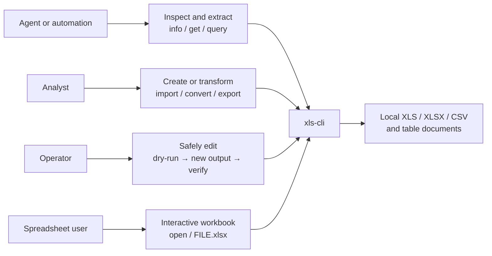
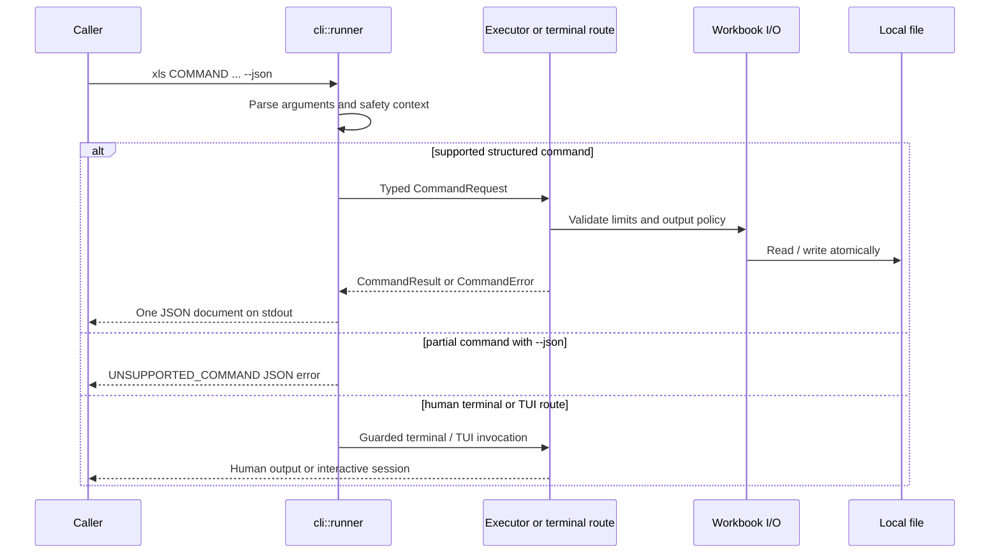
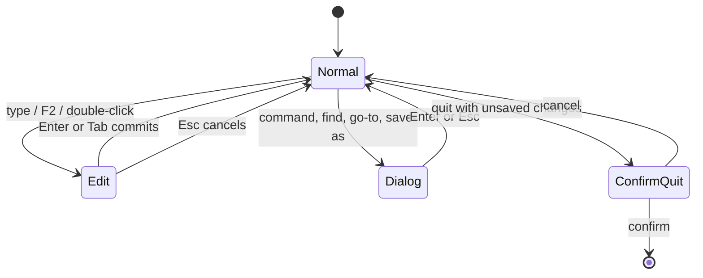

# xls-cli

`xls-cli` is a safe spreadsheet CLI and terminal UI for scripts, agents, and people. The Cargo package is `xls-cli`; the executable is always `xls`.

It provides a library-first JSON command protocol, a fuller human-terminal command surface, an interactive TUI, npm distribution for native binaries, and an agent Skill. Production code depends on EasyExcel-Rust components; it has no production dependency on the older `xls` fork.

> Status: the workspace currently contains development changes. Treat `xls capabilities --json` from the binary you run as the authority for supported commands.

```text
Agent Skill ─┐
             ├──> xls binary ──> structured CLI ──> EasyExcel components
Shell user ──┤          │
npm launcher ┘          └──> interactive TUI ────> EasyExcel components
```

中文说明请见 [README.zh-CN.md](README.zh-CN.md)。设计与实施依据见 [architecture](docs/XlsCli-Architecture.zh_CN.md) 和 [technical solution](docs/XlsCli-Technical-Solution.zh_CN.md)。

## Use cases



| Reader | Recommended entry | Expected outcome | Boundary |
|:---|:---|:---|:---|
| Agent or script | `capabilities --json` → `info` → supported command | A single versioned JSON result | Do not call a `partial` command as a JSON API. |
| Data analyst | `info`, `get`, `head`, `tail`, `query` | Metadata or extracted tabular data | `query` is read-only. |
| File producer | `import`, `new`, `convert`, `export` | A new output file in a requested format | Run dry-run before any write. |
| Spreadsheet user | `xls open FILE.xlsx` or `xls FILE.xlsx` | Interactive TUI session | Saving replaces the file only after an explicit user action. |

## Command guide and support boundary

The binary's `xls capabilities --json` result is the source of truth. The following matrix is a reader guide to the current implementation.

| Goal | Commands | JSON capability | Example |
|:---|:---|:---|:---|
| Discover a workbook | `info`, `get`, `head`, `tail` | `supported` | `xls get report.xlsx 'Sheet1!A1:J20' --json` |
| Query data | `query` | `supported`, read-only | `xls query report.xlsx 'SELECT * FROM Sheet1 LIMIT 20' --json` |
| Change cells and axes | `set`, `clear`, `fill`, `insert-row`, `delete-row`, `insert-col`, `delete-col` | `supported` | `xls fill in.xlsx 'Sheet1!B2:B10' 0 --output out.xlsx --json` |
| Manage sheets | `new`, `add-sheet`, `delete-sheet`, `rename-sheet`, `recalc` | `supported` | `xls recalc in.xlsx --output out.xlsx --json` |
| Exchange formats | `convert`, `import`, `export` | `supported` | `xls import tables.md report.xlsx --dry-run --json` |
| Inspect protocol | `capabilities`, `schema --command NAME` | `supported` | `xls schema --command get --json` |
| Work interactively | `open` or a workbook path | `partial` | `xls open report.xlsx` |
| Advanced terminal operations | `grep`, `profile`, `copy`, `move`, `append`, `filter`, `sort`, `dedup`, `join`, `pivot`, `diff`, `format`, `format-set`, `to-number`, `to-date`, `style`, `autofit`, `batch`, `name`, `table`, `eval` | `partial` | `xls pivot report.xlsx --help` |

`partial` means that a migrated human-terminal implementation exists, not that a structured result contract exists. `--json` intentionally returns `UNSUPPORTED_COMMAND` for those commands. Agent integrations must not parse human-oriented terminal output as an API substitute.

## Install and verify

Published npm consumers install the launcher package. Its optional dependency selects the native package for the current supported platform; install neither downloads arbitrary URLs nor compiles code.

```sh
npm install -g @easy4rust/xls-cli
xls --version
xls capabilities --json
```

Native npm packages are defined for macOS, Linux GNU, Linux musl, and Windows on `x64` and `arm64`. Unsupported platform/architecture pairs fail with an explicit launcher error.

For source development, place this repository beside the required `easyexcel-rust` checkout because the Cargo manifest uses relative path dependencies:

```text
parent/
├── xls-cli/
└── easyexcel-rust/
```

Then build and inspect the local binary:

```sh
cargo build
./target/debug/xls capabilities --json
XLS_CLI_BINARY="$PWD/target/debug/xls" node bin/xls.js --version
```

The crate declares Rust edition 2024 and MSRV `1.94` in `Cargo.toml`.

## Quick start

Inspect a workbook before extracting data:

```sh
xls info report.xlsx --json
xls get report.xlsx 'Sheet1!A1:J200' --format json --json
xls query report.xlsx 'SELECT category, SUM(amount) AS total FROM Sheet1 GROUP BY category' --json
```

Create a workbook from a Markdown table without replacing an existing file:

```sh
xls import tables.md generated.xlsx --dry-run --json
xls import tables.md generated.xlsx --json
xls info generated.xlsx --json
xls get generated.xlsx 'Table1!A1:F20' --json
```

Open a workbook in the interactive TUI:

```sh
xls open report.xlsx
# or
xls report.xlsx
```

The TUI supports selection, editing, undo/redo, clipboard operations, find/go-to, sheet switching, frozen panes, mouse interaction, column resizing, a command palette, and terminal restoration on normal exit or panic. TUI saving is an explicit user action and replaces its associated file path.

## Command execution flow



For every machine-driven write, use the following observable workflow:

| Step | Command shape | What to check before continuing |
|:---:|:---|:---|
| 1 | `xls capabilities --json` | The requested command is `supported`. |
| 2 | `xls info INPUT --json` | Input exists; sheet/range names are known. |
| 3 | `COMMAND ... --output OUTPUT --dry-run --json` | `files[].written` is `false`; warnings and paths are acceptable. |
| 4 | Same command without `--dry-run` | Output was reported as written. |
| 5 | `xls info OUTPUT --json` and focused `xls get` | Output reopens and the intended cells/data are present. |

## Migrated source coverage

The former standalone migration matrix is maintained here so the README remains self-contained. The migration moved CLI/TUI behavior from the Easy4Rust `xls` fork while replacing its core type paths with EasyExcel-Rust components. `xls-cli` has no production dependency on that old fork.

| Original area | Current location | Preserved responsibility | Integration adjustment |
|:---|:---|:---|:---|
| Binary and library entry | `src/main.rs`, `src/lib.rs`, `src/cli/runner.rs` | Thin entry, public CLI/TUI product boundary, exit handling | Runner owns JSON/stdout/stderr and routing. |
| Full terminal command surface | `src/cli/terminal.rs` | `clap` commands, edits, querying, formatting, names, tables | New guardrails run before the migrated route. |
| Structured command protocol | `src/cli/command_*.rs`, `default_command_executor.rs`, `schema.rs` | Typed request, result, errors, capability manifest | New library-first API; only `supported` commands promise it. |
| Rendering and streaming | `src/cli/render.rs`, `src/cli/stream.rs` | Table, CSV, TSV, JSON, JSONL, Markdown and HTML presentation | Component paths use EasyExcel; streaming covers XLSX/CSV row sinks. |
| Compatibility adapter | `src/cli/easyexcel_components.rs` | Narrow mapping from old core concepts | It does not duplicate workbook, formula, or format engines. |
| TUI runtime | `src/tui/runtime.rs`, `src/tui/mod.rs` | Event loop, key/mouse routing, terminal recovery, command palette | RAII guard and panic hook restore terminal state. |
| TUI application | `src/tui/app.rs`, `editor.rs`, `layout.rs`, `parse.rs`, `theme.rs`, `ui.rs` | Selection, editing, undo/redo, clipboard, find, layout, rendering | Uses `easyexcel::model::Workbook` and formula engine components. |
| TUI I/O | `src/tui/workbook_io.rs` | Open and save a session | Reuses CLI limits and atomic write; Ctrl+S is explicit replacement. |

### TUI interaction contract



| Behavior | Current contract |
|:---|:---|
| Editing | Cursor, range selection, formulas, clipboard, undo/redo, find/go-to, sheet tabs, scrollbars, frozen panes, and column resizing are part of the migrated TUI surface. |
| Saving | The interactive user explicitly triggers save; the associated path is then replaced through the unified workbook I/O policy. |
| Terminal recovery | Normal exit and panic handling restore raw mode, alternate screen, and mouse capture. |
| Formula state | The TUI recalculates workbook formula caches on open through `easyexcel_formula::Engine`. |

## Safe writing and secrets

Structured write commands deny replacement by default. Use a new output path, dry-run first, then reopen the result:

```sh
xls set source.xlsx 'Summary!B2' 42 --output revised.xlsx --dry-run --json
xls set source.xlsx 'Summary!B2' 42 --output revised.xlsx --json
xls info revised.xlsx --json
xls get revised.xlsx 'Summary!B2' --json
```

Use `--force` only when replacement of that exact target is intended. Passwords must never be supplied as command arguments:

```sh
printf '%s\n' "$WORKBOOK_PASSWORD" | xls info protected.xlsx --password-stdin --json
xls info protected.xlsx --password-env WORKBOOK_PASSWORD --json
```

The structured CLI sets these defaults for untrusted inputs: 256 MiB per file, 256 sheets, 2,000,000 total rows, and 500,000 formula cells. Lower them with the corresponding `--max-*` options when appropriate. Migrated terminal-only commands currently reject the resource-limit switches rather than silently ignoring them.

In JSON mode, stdout contains exactly one result or error object. Successful results include `schema_version`, `command`, `data`, `files`, `warnings`, `stats`, and `dry_run`; errors carry a stable code such as `OVERWRITE_DENIED`, `RESOURCE_LIMIT`, or `UNSUPPORTED_COMMAND`.

## Agent Skill

The source Skill is [skills/xls-cli/SKILL.md](skills/xls-cli/SKILL.md). `scripts/sync-skills.js` copies it to the OpenClaw and Hermes distribution paths.

Its required write sequence is:

```text
capabilities → info → dry-run → write a new file → info + focused get verification
```

This makes the capability manifest, not a stale README, the runtime truth.

## Development and release

The CI workflow performs formatting, Clippy, tests, JavaScript syntax checks, and `npm pack --dry-run`. Run the equivalent checks locally:

```sh
cargo fmt --check
cargo clippy --all-targets
cargo test --all-targets
node --check bin/xls.js
node --check bin/platform.js
npm pack --dry-run --ignore-scripts
```

Tagging `vX.Y.Z` triggers the release workflow. It builds eight native target packages, verifies all npm package versions, publishes platform packages before the launcher, and attaches native binaries plus SHA-256 checksums to the GitHub release.

## Provenance and license

The CLI/TUI source was migrated from the Easy4Rust `xls` fork and adapted to EasyExcel-Rust components; its migration coverage is documented in the **Migrated source coverage** section above. License terms are [MIT](LICENSE-MIT) or [Apache-2.0](LICENSE-APACHE); see [NOTICE](NOTICE) for provenance and third-party notices.

### Historical migration verification snapshot

The migration handoff recorded on 2026-08-05 reported formatting, Clippy, 106 Rust tests, CLI/TUI smoke checks, and eight npm package version checks as passing at that time. This is historical migration evidence, not a claim about the state of a different local dependency checkout. Run the commands in **Development and release** for current verification.
