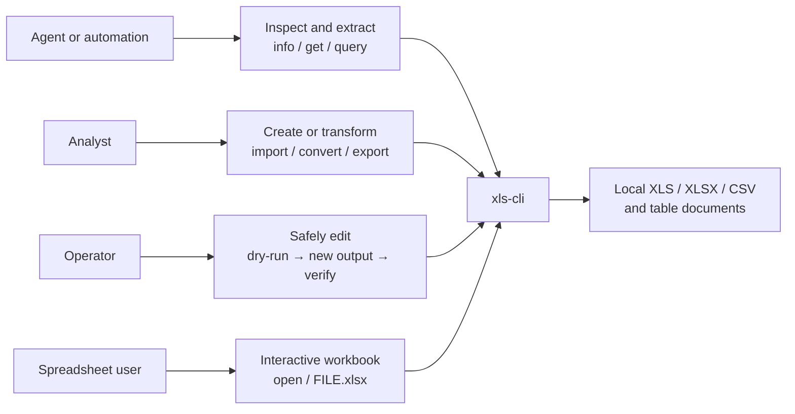
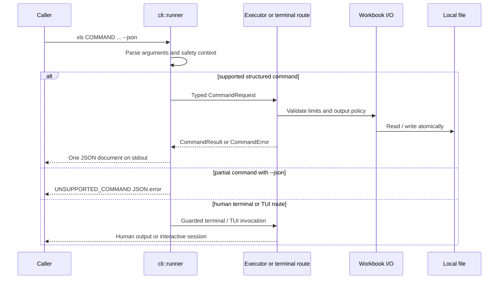
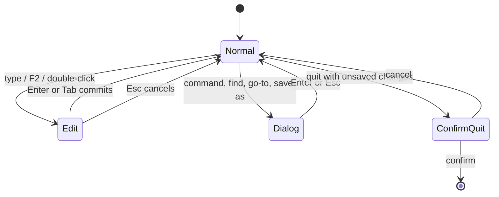

# xls-cli

`xls-cli` is a safe spreadsheet CLI and terminal UI for scripts, agents, and people. The Cargo package is `xls-cli`; the executable is always `xls`.

It provides a library-first JSON command protocol, a fuller human-terminal command surface, an interactive TUI, npm distribution for native binaries, and an agent Skill. Production code depends on EasyExcel-Rust components; it has no production dependency on the older `xls` fork.

> Status: the workspace currently contains development changes. Treat `xls capabilities --json` from the binary you run as the authority for supported commands.

```text
Agent Skill ─┐
             ├──> xls binary ──> structured CLI ──> EasyExcel components
Shell user ──┤          │
npm launcher ┘          └──> interactive TUI ────> EasyExcel components
```

See the [Chinese README](README.zh-CN.md). The [architecture](docs/XlsCli-Architecture.zh_CN.md) and [technical solution](docs/XlsCli-Technical-Solution.zh_CN.md) document the design and delivery boundaries.

## Why xls-cli

| Requirement | What xls-cli provides | Ownership boundary |
|:---|:---|:---|
| Legacy and modern spreadsheets | Read and write XLS (BIFF8), XLSX (OOXML), and CSV | `xls-cli` depends only on the `easyexcel` facade; format engines stay internal to EasyExcel-Rust. |
| Real formulas | Lexer/parser, dependency-aware recalculation, circular-reference detection, dynamic arrays, and `LAMBDA`-family functions | `easyexcel::formula` owns evaluation; `xls-cli` exposes `recalc` and the migrated terminal `eval`. |
| Round-trip editing | Cells, styles, number formats, merges, frozen panes, names, and tables | Fidelity is format-dependent and must be checked by reopening the generated file. |
| Agent-safe automation | Versioned JSON, capability discovery, stable errors, dry-run, resource limits, and explicit overwrite | The structured protocol is owned by `src/cli`; `partial` terminal commands are outside that contract. |
| Human spreadsheet work | A mouse-aware, vim-flavored TUI in the same native binary | TUI state is local to one process and file session. |
| Portable distribution | One Rust executable behind Cargo source builds and eight npm native packages | npm only selects and launches the installed binary; it does not reimplement spreadsheet behavior. |

The earlier `xls` project described itself as “a spreadsheet for your terminal.” `xls-cli` retains that full terminal experience and adds an auditable product boundary for scripts and agents.

## Use cases



| Reader | Recommended entry | Expected outcome | Boundary |
|:---|:---|:---|:---|
| Agent or script | `capabilities --json` → `info` → supported command | A single versioned JSON result | Do not call a `partial` command as a JSON API. |
| Data analyst | `info`, `get`, `head`, `tail`, `query` | Metadata or extracted tabular data | `query` is read-only. |
| File producer | `import`, `new`, `convert`, `export` | A new output file in a requested format | Run dry-run before any write. |
| Spreadsheet user | `xls open FILE.xlsx` or `xls FILE.xlsx` | Interactive TUI session | Saving replaces the file only after an explicit user action. |

## Command guide and support boundary

The binary's `xls capabilities --json` result is the source of truth. The following matrix is a reader guide to the current implementation.

| Goal | Commands | JSON capability | Example |
|:---|:---|:---|:---|
| Discover a workbook | `info`, `get`, `head`, `tail` | `supported` | `xls get report.xlsx 'Sheet1!A1:J20' --json` |
| Query data | `query` | `supported`, read-only | `xls query report.xlsx 'SELECT * FROM Sheet1 LIMIT 20' --json` |
| Change cells and axes | `set`, `clear`, `fill`, `insert-row`, `delete-row`, `insert-col`, `delete-col` | `supported` | `xls fill in.xlsx 'Sheet1!B2:B10' 0 --output out.xlsx --json` |
| Manage sheets | `new`, `add-sheet`, `delete-sheet`, `rename-sheet`, `recalc` | `supported` | `xls recalc in.xlsx --output out.xlsx --json` |
| Exchange formats | `convert`, `import`, `export` | `supported` | `xls import tables.md report.xlsx --dry-run --json` |
| Inspect protocol | `capabilities`, `schema --command NAME` | `supported` | `xls schema --command get --json` |
| Work interactively | `open` or a workbook path | `partial` | `xls open report.xlsx` |
| Search / profile / compute | `grep`, `profile`, `eval`, `format` | `supported` | `xls grep report.xlsx ZANMAI --json` |
| Filter / reshape / aggregate | `filter`, `sort`, `dedup`, `copy`, `move`, `append`, `pivot` | `supported` | `xls filter report.xlsx 'amount>1000' --json` |
| Combine workbooks | `join`, `diff` | `supported` | `xls diff before.xlsx after.xlsx --key date --json` |
| Advanced terminal operations | `format-set`, `to-number`, `to-date`, `style`, `autofit`, `batch`, `name`, `table` | `partial` | `xls batch report.xlsx --help` |

`partial` means that a migrated human-terminal implementation exists, not that a structured result contract exists. `--json` intentionally returns `UNSUPPORTED_COMMAND` for those commands. Agent integrations must not parse human-oriented terminal output as an API substitute.

## Install and verify

The `xls` binary and the `xls-cli` Skill are separate layers: npm/Cargo makes the command executable, while the Skill teaches an agent how to call it safely. Agent deployments need both layers.

### Install the `xls` binary

Published npm consumers install the launcher package. Its optional dependency selects the native package for the current supported platform; installation neither downloads arbitrary URLs nor compiles Rust locally.

```sh
npm install -g @partme.ai/xls-cli
xls --version
xls capabilities --json
```

Native npm packages are defined for macOS, Linux GNU, Linux musl, and Windows on `x64` and `arm64`. Unsupported platform/architecture pairs fail with an explicit launcher error.

For source development, or before the npm package is published, place this repository beside the required `easyexcel-rust` checkout because the Cargo manifest uses a relative path dependency:

```text
parent/
├── xls-cli/
└── easyexcel-rust/
```

Then build and inspect the local binary:

```sh
cargo build
./target/debug/xls capabilities --json
XLS_CLI_BINARY="$PWD/target/debug/xls" node bin/xls.js --version
```

The crate declares Rust edition 2024 and MSRV `1.88` in `Cargo.toml`.

### Install the `xls-cli` Skill

Install the Skill directly from GitHub with the universal Skills CLI. No repository checkout or manual file copy is required:

```sh
npx skills add easy-4-rust/xls-cli
```

For a non-interactive project install, or a global user-level install:

```sh
npx skills add easy-4-rust/xls-cli --skill xls-cli --yes
npx skills add easy-4-rust/xls-cli --skill xls-cli --global --yes
```

To give an agent the complete instructions without installing the Skill, generate an agent-ready prompt:

```sh
npx skills use easy-4-rust/xls-cli@xls-cli
```

An agent that can read URLs may instead be given the canonical raw Skill directly:

```text
Read and follow this Skill before working with spreadsheet files:
https://raw.githubusercontent.com/easy-4-rust/xls-cli/main/skills/xls-cli/SKILL.md
```

Start a new agent session, or reload its Skill index, after installation. Then ask it to run `xls --version` and `xls capabilities --json`. The Skill teaches safe usage but does not embed the `xls` binary; install or build the binary separately. The repository layout follows the [Agent Skills specification](https://agentskills.io/), so the same command works with Codex, Claude Code, Cursor, OpenCode, Gemini CLI, GitHub Copilot, and other Skills CLI targets.

## Quick start

Inspect a workbook before extracting data:

```sh
xls info report.xlsx --json
xls get report.xlsx 'Sheet1!A1:J200' --format json --json
xls query report.xlsx 'SELECT category, SUM(amount) AS total FROM Sheet1 GROUP BY category' --json
```

Create a workbook from a Markdown table without replacing an existing file:

```sh
xls import tables.md generated.xlsx --dry-run --json
xls import tables.md generated.xlsx --json
xls info generated.xlsx --json
xls get generated.xlsx 'Sales!A1:F20' --json
```

Export XLS/XLSX/CSV through EasyExcel's Markdown projection layer:

```sh
xls export report.xlsx report.md --format markdown \
  --mode auto --formula cached --merge anchor --json
xls import tables.md generated.xlsx \
  --infer-types conservative --json
```

Open a workbook in the interactive TUI:

```sh
xls open report.xlsx
# or
xls report.xlsx
```

The TUI supports selection, editing, undo/redo, clipboard operations, find/go-to, sheet switching, frozen panes, mouse interaction, column resizing, a command palette, and terminal restoration on normal exit or panic. TUI saving is an explicit user action and replaces its associated file path.

### Discover commands

Do not guess the current build from a README. Human users should inspect help; scripts and agents should inspect capabilities and schemas:

```sh
xls --help
xls export --help
xls import --help
xls capabilities --json
xls schema --command export --json
```

| Task | Commands | Important inputs |
|:---|:---|:---|
| Inspect and extract | `info`, `get`, `head`, `tail` | `RANGE`, `--sheet`, `--format`, `-n` |
| Query | `query` | Read-only SQL string |
| Edit cells | `set`, `clear`, `fill` | `--output`, `--dry-run`, `--force` |
| Edit rows/columns | `insert-row`, `delete-row`, `insert-col`, `delete-col` | Zero-based position, `-n/--count`, `--sheet` |
| Manage workbooks | `new`, `add-sheet`, `delete-sheet`, `rename-sheet`, `recalc` | Output path and sheet names |
| Exchange files | `convert`, `import`, `export` | Target extension, `--format`, Markdown policies |
| Discover protocol | `capabilities`, `schema` | `--json`, `--command NAME` |

The clap commands use singular names such as `insert-row`; the capability protocol uses stable names `insert-rows`, `delete-rows`, `insert-columns`, and `delete-columns`. Plural CLI aliases remain accepted.

## Detailed CLI recipes

There are two output surfaces. Commands with `--json` use the stable structured protocol when their capability is `supported`. Commands without `--json` may use the richer migrated human-terminal surface. The examples below keep that distinction explicit.

### Inspect, extract, and evaluate

| Task | Command | Surface |
|:---|:---|:---|
| Workbook metadata | `xls info report.xlsx --json` | Structured, supported |
| One cell or A1 range | `xls get report.xlsx 'Sheet1!A1:J200' --format json --json` | Structured, supported |
| First/last rows | `xls head report.xlsx -n 20 --json` / `xls tail report.xlsx -n 20 --json` | Structured, supported |
| Human table/CSV/TSV/JSONL/Markdown output | `xls get report.xlsx 'A1:J200' --format jsonl --header` | Migrated terminal |
| Raw values and date representation | `xls get report.xlsx 'A1:J200' --raw --dates iso` | Migrated terminal |
| Evaluate a scalar or array formula | `xls eval report.xlsx '=AVERAGE(A1:A10)' --json` | Structured, `data.value` / `data.grid` |
| Inspect number format | `xls format report.xlsx C2 --json` | Structured, `data.format` |
| Search cells | `xls grep report.xlsx ZANMAI --json` | Structured, `data.matches` |
| Column quality profile | `xls profile report.xlsx amount --json` | Structured, stats + stable warnings |
| Compare workbooks | `xls diff before.xlsx after.xlsx --key date --json` | Structured, keyed/cell differences |

Terminal `get` supports `table`, `csv`, `tsv`, `json`, `jsonl`, and `md`; `--header` uses the first row as object keys or labels. `--raw` suppresses display formatting, and `--dates iso|serial` controls date-formatted numeric cells.

### Query, reshape, and combine

```sh
# Structured, read-only SQL. Sheets are tables and row 0 is the header.
xls query report.xlsx \
  'SELECT category, SUM(amount) AS total FROM Sheet1 GROUP BY category ORDER BY total DESC' \
  --json

# Migrated human-terminal operations; capability is partial for JSON callers.
xls pivot report.xlsx --rows category --values amount --agg sum
xls filter report.xlsx 'amount>1000' --format csv
xls join customers.xlsx orders.xlsx --on id
```

The SQL engine supports the repository's implemented read-only subset, including filtering, grouping, joins, ordering, and limits. Use command help and fixtures rather than assuming full database SQL compatibility.

### Create and edit safely

```sh
# Stable structured writes: plan, write a new file, then reopen it.
xls new book.xlsx --sheet Data --dry-run --json
xls new book.xlsx --sheet Data --json
xls set book.xlsx 'Data!A1' '=SUM(B:B)' --output revised.xlsx --dry-run --json
xls set book.xlsx 'Data!A1' '=SUM(B:B)' --output revised.xlsx --json
xls fill revised.xlsx 'Data!B2:B20' 0 --output filled.xlsx --json
xls insert-row filled.xlsx 3 -n 2 --output expanded.xlsx --json
xls add-sheet expanded.xlsx Summary --output with-summary.xlsx --json
xls recalc with-summary.xlsx --output recalculated.xlsx --json
```

Advanced migrated mutations remain terminal-only and must use `--output`, `--dry-run`, `--backup`, or explicit `--force`:

```sh
xls batch report.xlsx --set A1=1 --set B2=hi --output edited.xlsx
xls sort report.xlsx --by amount --desc --output sorted.xlsx
xls dedup report.xlsx --on id --output deduplicated.xlsx
xls append base.xlsx new.xlsx --output combined.xlsx
xls to-number report.xlsx H1:H200 --output numbers.xlsx
xls to-date report.xlsx A2:A83 --format dd/mm/yyyy --output dates.xlsx
xls format-set report.xlsx C2:C154 'dd/mm/yyyy' --output formatted.xlsx
xls autofit report.xlsx --output fitted.xlsx
xls style report.xlsx A1:D1 --bold --bg FFFF00 --output styled.xlsx
xls copy report.xlsx A1:B3 D1 --output copied.xlsx
```

Numeric-looking text is coerced by applicable formula functions without rewriting the source; `COUNT` remains strict, so a `COUNT`/`COUNTA` difference can reveal text-stored numbers. Use `to-number` for a permanent conversion. Likewise, use `to-date` to convert text dates to serial values with an explicit number format.

### Names, tables, conversion, and streaming

```sh
# Names and tables are migrated terminal capabilities (partial for JSON callers).
xls table add report.xlsx A1:C20 --name Sales --output tabled.xlsx
xls get tabled.xlsx 'Sales[Amount]' --format csv
xls eval tabled.xlsx '=SUM(Sales[Amount])'
xls name add tabled.xlsx TaxRate 'Sheet1!$E$1' --output named.xlsx

# Structured exchange commands.
xls convert old.xls converted.xlsx --dry-run --json
xls convert old.xls converted.xlsx --json
xls import tables.md generated.xlsx --dry-run --json
xls import tables.md generated.xlsx --json
xls export generated.xlsx exported.csv --format csv --dry-run --json
xls export generated.xlsx exported.csv --format csv --json

# Current structured export syntax (materialized workbook path).
xls export huge.xlsx huge.csv --format csv --json
```

Structured Markdown export supports `--mode auto|event|workbook`; `--stream` is an alias for `--mode event`. Event Mode applies only to **XLSX/CSV → Markdown**, uses cached formula values, and keeps memory bounded. XLS, expression output, and policies requiring complete merge metadata use Workbook Mode. An explicitly incompatible Event request fails instead of silently degrading. The migrated terminal reader still accepts `-` for CSV stdin in commands such as `eval`; stdin mutations require an explicit output path.

## Command execution flow



For every machine-driven write, use the following observable workflow:

| Step | Command shape | What to check before continuing |
|:---:|:---|:---|
| 1 | `xls capabilities --json` | The requested command is `supported`. |
| 2 | `xls info INPUT --json` | Input exists; sheet/range names are known. |
| 3 | `COMMAND ... --output OUTPUT --dry-run --json` | `files[].written` is `false`; warnings and paths are acceptable. |
| 4 | Same command without `--dry-run` | Output was reported as written. |
| 5 | `xls info OUTPUT --json` and focused `xls get` | Output reopens and the intended cells/data are present. |

## Migrated source coverage

The former standalone migration matrix is maintained here so the README remains self-contained. The migration moved CLI/TUI behavior from the Easy4Rust `xls` fork while replacing its core type paths with EasyExcel-Rust components. `xls-cli` has no production dependency on that old fork.

| Original area | Current location | Preserved responsibility | Integration adjustment |
|:---|:---|:---|:---|
| Binary and library entry | `src/main.rs`, `src/lib.rs`, `src/cli/runner.rs` | Thin entry, public CLI/TUI product boundary, exit handling | Runner owns JSON/stdout/stderr and routing. |
| Full terminal command surface | `src/cli/terminal.rs` | `clap` commands, edits, querying, formatting, names, tables | New guardrails run before the migrated route. |
| Structured command protocol | `src/cli/command_*.rs`, `default_command_executor.rs`, `schema.rs` | Typed request, result, errors, capability manifest | New library-first API; only `supported` commands promise it. |
| Rendering and streaming | `src/cli/render.rs`, `src/cli/stream.rs` | Table, CSV, TSV, JSON, JSONL, Markdown and HTML presentation | Component paths use EasyExcel; streaming covers XLSX/CSV row sinks. |
| Compatibility adapter | `src/cli/easyexcel_components.rs` | Narrow mapping from old core concepts | It does not duplicate workbook, formula, or format engines. |
| TUI runtime | `src/tui/runtime.rs`, `src/tui/mod.rs` | Event loop, key/mouse routing, terminal recovery, command palette | RAII guard and panic hook restore terminal state. |
| TUI application | `src/tui/app.rs`, `editor.rs`, `layout.rs`, `parse.rs`, `theme.rs`, `ui.rs` | Selection, editing, undo/redo, clipboard, find, layout, rendering | Uses `easyexcel::model::Workbook` and formula engine components. |
| TUI I/O | `src/tui/workbook_io.rs` | Open and save a session | Reuses CLI limits and atomic write; Ctrl+S is explicit replacement. |

### TUI interaction contract



| Behavior | Current contract |
|:---|:---|
| Editing | Cursor, range selection, formulas, clipboard, undo/redo, find/go-to, sheet tabs, scrollbars, frozen panes, and column resizing are part of the migrated TUI surface. |
| Saving | The interactive user explicitly triggers save; the associated path is then replaced through the unified workbook I/O policy. |
| Terminal recovery | Normal exit and panic handling restore raw mode, alternate screen, and mouse capture. |
| Formula state | The TUI recalculates workbook formula caches on open through `easyexcel::formula::Engine`. |

## Rust library boundary

The old project exposed workbook internals as `xls::core`. That responsibility now belongs behind the `easyexcel` facade. The `xls-cli` library instead exposes the stable application boundary: typed requests, execution context, capability manifest, result/error types, and the reusable executor.

```rust
use xls_cli::{
    CommandExecutor, CommandRequest, DefaultCommandExecutor, ExecutionContext,
};

fn main() -> Result<(), Box<dyn std::error::Error>> {
    let result = DefaultCommandExecutor::new().execute(
        CommandRequest::Info {
            input: "report.xlsx".into(),
        },
        &ExecutionContext::new(),
    )?;
    println!("{}", serde_json::to_string_pretty(&result)?);
    Ok(())
}
```

Applications that need direct workbook/model/formula APIs should depend on the corresponding EasyExcel-Rust component rather than importing a compatibility module from `xls-cli`.

## Formula engine and data semantics

The migrated formula-engine source records one-by-one coverage of 522 standard worksheet functions. That count is source-coverage evidence from the migrated engine, not a field in `xls capabilities`; the actual linked EasyExcel-Rust revision remains the runtime authority.

| Category | Representative functions |
|:---|:---|
| Logical | `IF`, `IFS`, `SWITCH`, `AND`, `OR`, `XOR`, `IFERROR` |
| Math and trigonometry | `SUM`, `SUMIFS`, `SUMPRODUCT`, `ROUND`, `MOD`, `MDETERM`, `MMULT`, `SUBTOTAL`, `AGGREGATE` |
| Statistical | `AVERAGEIFS`, `MEDIAN`, `STDEV.S`, `PERCENTILE.INC`, `RANK.EQ`, `NORM.DIST`, `CHISQ.TEST`, `FREQUENCY` |
| Text | `LEFT`, `MID`, `SUBSTITUTE`, `TEXT`, `TEXTJOIN`, `TEXTBEFORE`, `REGEXEXTRACT`, `TEXTSPLIT` |
| Lookup and reference | `VLOOKUP`, `XLOOKUP`, `INDEX`, `MATCH`, `OFFSET`, `INDIRECT`, `XMATCH` |
| Dynamic arrays | `SORT`, `SORTBY`, `UNIQUE`, `FILTER`, `SEQUENCE`, `VSTACK`, `HSTACK`, `TAKE`, `DROP` |
| Functional formulas | `LAMBDA`, `LET`, `MAP`, `REDUCE`, `SCAN`, `BYROW`, `BYCOL`, `MAKEARRAY` |
| Date and time | `DATE`, `EDATE`, `EOMONTH`, `NETWORKDAYS`, `YEARFRAC`, `WEEKNUM` |
| Financial | `PMT`, `NPV`, `IRR`, `XIRR`, `PRICE`, `YIELD`, `DURATION`, `MIRR` |
| Engineering/information/database | Base and bit functions, `CONVERT`, `ERF`, complex `IM*`, `ISNUMBER`, `TYPE`, `CELL`, `DSUM`, `DGET` |

Dynamic-array results spill into neighboring cells and report `#SPILL!` when blocked. `LAMBDA` values can be used through `LET` and higher-order functions. Range operators broadcast element-wise; use `MAP` when a scalar function must be applied to every array element. Functions requiring a host application, external web data, or OLAP/cube connections remain outside the deterministic local engine and may return `#N/A`.

## Format and encryption support

| Format | Read | Write/export | Important behavior |
|:---|:---:|:---:|:---|
| XLSX | ✅ | ✅ | OOXML cells, formulas, styles, merges, frozen panes, names, and tables; the foundation includes row-streaming readers. Round-trip opaque-part fidelity must be verified for the files you depend on. |
| XLS (BIFF8) | ✅ | ✅ | Native Rust reader/writer; formula output may rely on cached values depending on format constraints. |
| CSV | ✅ | ✅ | Delimiter detection, BOM/encoding handling, and scalar inference are provided by the EasyExcel CSV component. |
| TSV | Terminal/text input family | ✅ export | Primarily a tabular text output rather than a workbook container. |
| Markdown | ✅ import | ✅ export | `AgentStable` by default; nearest headings name sheets, `007` stays text, formulas/merges produce explicit policy results and warnings. XLSX/CSV can stream; XLS is Workbook Mode only. |
| Static HTML | ✅ import | ✅ export | Parses local `<table>` markup only; no scripts, remote resources, or uncontrolled CSS execution. |
| JSON tables | ✅ import | ✅ export | Structured table interchange; not a serialized internal workbook model. |

Password-protected XLSX files can be opened through `--password-stdin` or `--password-env NAME`. Never put secrets in argv. Re-encryption is not promised: write to a new output path and treat the result as unencrypted unless the runtime explicitly reports otherwise. Legacy RC4/XOR or uncommon encryption schemes may be identified without being decryptable.

## Safe writing and secrets

Structured write commands deny replacement by default. Use a new output path, dry-run first, then reopen the result:

```sh
xls set source.xlsx 'Summary!B2' 42 --output revised.xlsx --dry-run --json
xls set source.xlsx 'Summary!B2' 42 --output revised.xlsx --json
xls info revised.xlsx --json
xls get revised.xlsx 'Summary!B2' --json
```

Use `--force` only when replacement of that exact target is intended. Passwords must never be supplied as command arguments:

```sh
printf '%s\n' "$WORKBOOK_PASSWORD" | xls info protected.xlsx --password-stdin --json
xls info protected.xlsx --password-env WORKBOOK_PASSWORD --json
```

The structured CLI sets these defaults for untrusted inputs: 256 MiB per file, 256 sheets, 2,000,000 total rows, and 500,000 formula cells. Lower them with the corresponding `--max-*` options when appropriate. Migrated terminal-only commands currently reject the resource-limit switches rather than silently ignoring them.

In JSON mode, stdout contains exactly one result or error object. Successful results include `schema_version`, `command`, `data`, `files`, `warnings`, `stats`, and `dry_run`; errors carry a stable code such as `OVERWRITE_DENIED`, `RESOURCE_LIMIT`, or `UNSUPPORTED_COMMAND`.

## Agent Skill

The canonical source is [skills/xls-cli/SKILL.md](skills/xls-cli/SKILL.md), which the Skills CLI discovers directly from this repository. The copies under `skills/dist/<agent>/xls-cli/` are compatibility artifacts for OpenClaw and Hermes packaging, not the recommended installation path. Maintainers use `node scripts/sync-skills.js` to keep those copies identical to the source.

Its required write sequence is:

```text
capabilities → info → dry-run → write a new file → info + focused get verification
```

This makes the capability manifest, not a stale README, the runtime truth.

After installing the Skill, users can describe the intended result instead of assembling every command manually:

```text
Use xls-cli to inspect report.xlsx, extract Sales!A1:F200, and return JSON.
Use xls-cli to create result.xlsx from tables.md; dry-run first, do not overwrite anything, then reopen and verify it.
Use xls-cli to export report.xlsx as AgentStable Markdown and preserve every structured warning.
```

The Skill enforces `capabilities → info → dry-run → apply → reopen/get`. It also prevents passwords in argv, refuses to treat `partial` commands as JSON APIs, treats warnings as result data, and disallows `--force` without explicit authorization for the exact path.

## Development and release

The CI workflow performs formatting, Clippy, tests, JavaScript syntax checks, and `npm pack --dry-run`. Run the equivalent checks locally:

```sh
cargo fmt --check
cargo clippy --all-targets
cargo test --all-targets
node --check bin/xls.js
node --check bin/platform.js
npm pack --dry-run --ignore-scripts
```

Tagging `vX.Y.Z` triggers the release workflow. It builds eight native target packages, verifies all npm package versions, publishes platform packages before the launcher, and attaches native binaries plus SHA-256 checksums to the GitHub release.

## Provenance and license

The CLI/TUI source was migrated from the Easy4Rust `xls` fork and adapted to the `easyexcel` facade; its migration coverage is documented in the **Migrated source coverage** section above. License terms are [MIT](LICENSE-MIT) or [Apache-2.0](LICENSE-APACHE); see [NOTICE](NOTICE) for provenance and third-party notices.

### Historical migration verification snapshot

The migration handoff recorded on 2026-08-05 reported formatting, Clippy, 106 Rust tests, CLI/TUI smoke checks, and eight npm package version checks as passing at that time. This is historical migration evidence, not a claim about the state of a different local dependency checkout. Run the commands in **Development and release** for current verification.

The current Markdown convergence change passed 104 library tests, 3 process protocol tests,
`cargo clippy --all-targets --all-features -- -D warnings`, capability discovery and export schema validation on 2026-08-06.
