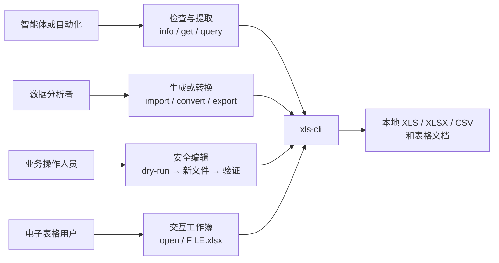
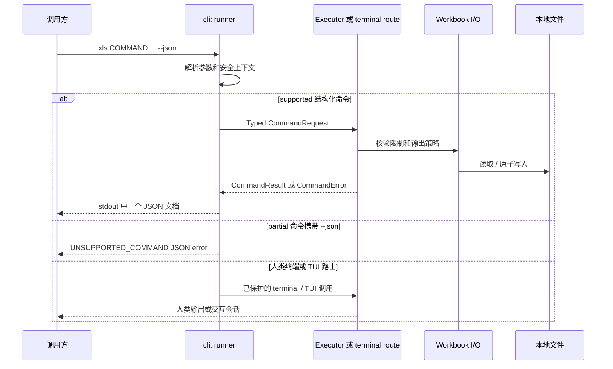
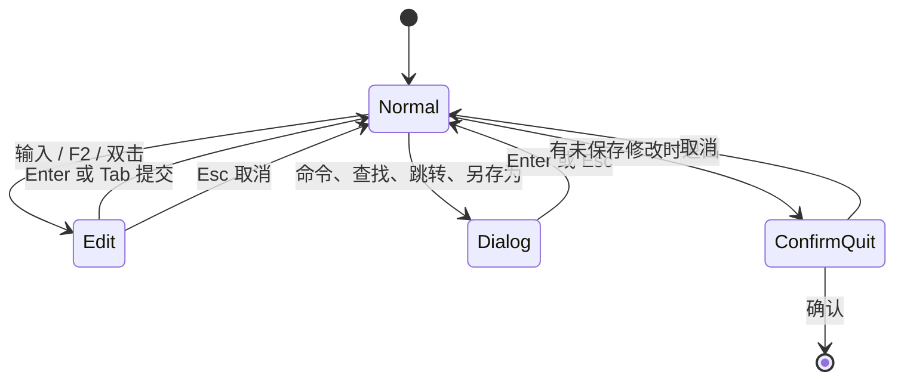

# xls-cli

`xls-cli` 是面向脚本、智能体与终端用户的安全电子表格 CLI/TUI。Cargo package 名为 `xls-cli`，最终二进制固定为 `xls`。

仓库提供 library-first JSON 命令协议、完整的人类终端命令面、交互式 TUI、npm 原生包分发与 Agent Skill。生产代码只依赖 EasyExcel-Rust 组件，不依赖旧 `xls` fork。

> 状态：当前工作区包含开发中改动。执行环境中 `xls capabilities --json` 的返回值才是支持命令的唯一事实来源。

```text
Agent Skill ─┐
             ├──> xls 二进制 ──> 结构化 CLI ──> EasyExcel 组件
Shell 用户 ──┤        │
npm 启动器 ──┘        └──> 交互式 TUI ───────> EasyExcel 组件
```

英文说明见 [README.md](README.md)。设计与实施依据见[架构文档](docs/XlsCli-Architecture.zh_CN.md)和[技术方案](docs/XlsCli-Technical-Solution.zh_CN.md)。

## 为什么选择 xls-cli

| 需求 | xls-cli 提供的能力 | 责任边界 |
|:---|:---|:---|
| 新旧电子表格 | 读取和写入 XLS（BIFF8）、XLSX（OOXML）和 CSV | `xls-cli` 只依赖 `easyexcel` 门面；格式引擎保持为 EasyExcel-Rust 内部实现。 |
| 真实公式 | 词法/语法解析、依赖重算、循环引用检测、动态数组和 `LAMBDA` 系列函数 | `easyexcel::formula` 负责求值；`xls-cli` 暴露 `recalc` 与结构化 `eval`。 |
| 往返编辑 | 单元格、样式、数字格式、合并、冻结窗格、名称和表格 | 保真度取决于格式，生成后必须重新打开验证。 |
| 智能体安全自动化 | 版本化 JSON、能力探测、稳定错误、dry-run、资源限制和显式覆盖 | 结构化协议归 `src/cli` 所有；`partial` 终端命令不属于该契约。 |
| 人类电子表格操作 | 同一原生二进制中的鼠标感知、Vim 风格 TUI | TUI 状态只存在于当前进程和文件会话。 |
| 可移植分发 | 一个 Rust 可执行文件、Cargo 源码构建和 8 个 npm 原生平台包 | npm 仅选择并启动已安装二进制，不重复实现电子表格逻辑。 |

旧 `xls` 将自身定义为“终端中的电子表格”。`xls-cli` 完整保留该终端体验，并增加面向脚本和智能体的可审计产品边界。

## 使用场景



| 使用者 | 推荐入口 | 预期结果 | 边界 |
|:---|:---|:---|:---|
| 智能体或脚本 | `capabilities --json` → `info` → supported 命令 | 一个带版本的 JSON 结果 | 不得将 `partial` 命令当作 JSON API。 |
| 数据分析者 | `info`、`get`、`head`、`tail`、`query` | 元数据或表格数据 | `query` 只读。 |
| 文件生成者 | `import`、`new`、`convert`、`export` | 指定格式的新输出文件 | 每次写入先执行 dry-run。 |
| 电子表格用户 | `xls open FILE.xlsx` 或 `xls FILE.xlsx` | 交互式 TUI 会话 | 仅用户明确保存时替换关联文件。 |

## 命令说明与支持边界

二进制的 `xls capabilities --json` 是唯一能力事实来源。下表帮助读者选择当前实现的入口。

| 目标 | 命令 | JSON 能力 | 示例 |
|:---|:---|:---|:---|
| 识别工作簿 | `info`、`get`、`head`、`tail` | `supported` | `xls get report.xlsx 'Sheet1!A1:J20' --json` |
| 查询数据 | `query` | `supported`，只读 | `xls query report.xlsx 'SELECT * FROM Sheet1 LIMIT 20' --json` |
| 修改单元格和坐标轴 | `set`、`clear`、`fill`、`insert-row`、`delete-row`、`insert-col`、`delete-col` | `supported` | `xls fill in.xlsx 'Sheet1!B2:B10' 0 --output out.xlsx --json` |
| 管理工作表 | `new`、`add-sheet`、`delete-sheet`、`rename-sheet`、`recalc` | `supported` | `xls recalc in.xlsx --output out.xlsx --json` |
| 交换格式 | `convert`、`import`、`export` | `supported` | `xls import tables.md report.xlsx --dry-run --json` |
| 检查协议 | `capabilities`、`schema --command NAME` | `supported` | `xls schema --command get --json` |
| 交互工作簿 | `open` 或工作簿路径 | `partial` | `xls open report.xlsx` |
| 搜索/画像/计算 | `grep`、`profile`、`eval`、`format` | `supported` | `xls grep report.xlsx ZANMAI --json` |
| 高级终端操作 | `copy`、`move`、`append`、`filter`、`sort`、`dedup`、`join`、`pivot`、`diff`、`format-set`、`to-number`、`to-date`、`style`、`autofit`、`batch`、`name`、`table` | `partial` | `xls pivot report.xlsx --help` |

`partial` 表示存在已迁移的人类终端实现，并不表示存在结构化 result contract。为避免智能体误用，传入 `--json` 会明确返回 `UNSUPPORTED_COMMAND`；不得解析人类终端文本作为替代 API。

## 安装与验证

`xls` 二进制和 `xls-cli` Skill 是两层独立能力：npm/Cargo 安装负责让命令可执行，Skill 安装负责教智能体以安全顺序调用命令。智能体场景需要同时完成两层安装。

### 安装 `xls` 二进制

已发布的 npm 使用者安装启动器包。它通过 optional dependency 选择当前平台的原生包；安装过程不下载任意 URL，也不在本机临时编译。

```sh
npm install -g @partme.ai/xls-cli
xls --version
xls capabilities --json
```

npm 原生包覆盖 macOS、Linux GNU、Linux musl 与 Windows 的 `x64`、`arm64`。不支持的平台或架构会由启动器显式报错。

源码开发或尚未发布 npm 包时，将本仓库与 `easyexcel-rust` 检出到同一父目录，因为 `Cargo.toml` 使用相对 path dependency：

```text
parent/
├── xls-cli/
└── easyexcel-rust/
```

```sh
cargo build
./target/debug/xls capabilities --json
XLS_CLI_BINARY="$PWD/target/debug/xls" node bin/xls.js --version
```

`Cargo.toml` 声明 Rust edition 2024 与 MSRV `1.88`。

### 安装 `xls-cli` Skill

使用通用 Skills CLI 直接从 GitHub 安装，无需 checkout 仓库，也无需手工复制文件：

```sh
npx skills add easy-4-rust/xls-cli
```

非交互式安装到当前项目，或者安装为用户级全局 Skill：

```sh
npx skills add easy-4-rust/xls-cli --skill xls-cli --yes
npx skills add easy-4-rust/xls-cli --skill xls-cli --global --yes
```

如果不安装 Skill，而是希望直接得到一份可以交给智能体读取的完整提示词：

```sh
npx skills use easy-4-rust/xls-cli@xls-cli
```

能够读取 URL 的智能体，也可以直接读取规范 Skill 原文：

```text
处理电子表格文件前，请先读取并遵循这个 Skill：
https://raw.githubusercontent.com/easy-4-rust/xls-cli/main/skills/xls-cli/SKILL.md
```

安装后启动新的智能体会话，或让智能体重新加载 Skill 索引，然后执行 `xls --version` 和 `xls capabilities --json`。Skill 只负责教智能体安全调用，不内嵌 `xls` 二进制；二进制仍需单独安装或构建。仓库遵循 [Agent Skills 规范](https://agentskills.io/)，因此同一条命令可用于 Codex、Claude Code、Cursor、OpenCode、Gemini CLI、GitHub Copilot 及其他 Skills CLI 目标。

## 快速开始

先查看工作簿，再提取数据：

```sh
xls info report.xlsx --json
xls get report.xlsx 'Sheet1!A1:J200' --format json --json
xls query report.xlsx 'SELECT category, SUM(amount) AS total FROM Sheet1 GROUP BY category' --json
```

从 Markdown 表格生成工作簿，先 dry-run：

```sh
xls import tables.md generated.xlsx --dry-run --json
xls import tables.md generated.xlsx --json
xls info generated.xlsx --json
xls get generated.xlsx 'Sales!A1:F20' --json
```

通过 EasyExcel Markdown 投影层导出 XLS/XLSX/CSV：

```sh
xls export report.xlsx report.md --format markdown \
  --mode auto --formula cached --merge anchor --json
xls import tables.md generated.xlsx \
  --infer-types conservative --json
```

打开交互式 TUI：

```sh
xls open report.xlsx
# 或
xls report.xlsx
```

TUI 已包含选择、编辑、撤销/重做、剪贴板、查找/跳转、工作表切换、冻结窗格、鼠标交互、列宽拖动、命令面板，以及正常退出或 panic 后的终端恢复。TUI 保存属于用户明确发起的覆盖操作，会替换关联路径。

### 命令发现

不要依赖 README 猜测当前构建能力。人类用户先看命令帮助，脚本和智能体先看 capability 与 schema：

```sh
xls --help
xls export --help
xls import --help
xls capabilities --json
xls schema --command export --json
```

| 任务 | 命令 | 关键参数 |
|:---|:---|:---|
| 检查与提取 | `info`、`get`、`head`、`tail` | `RANGE`、`--sheet`、`--format`、`-n` |
| 查询 | `query` | 只读 SQL 字符串 |
| 单元格编辑 | `set`、`clear`、`fill` | `--output`、`--dry-run`、`--force` |
| 行列编辑 | `insert-row`、`delete-row`、`insert-col`、`delete-col` | 零基位置、`-n/--count`、`--sheet` |
| 工作簿管理 | `new`、`add-sheet`、`delete-sheet`、`rename-sheet`、`recalc` | 输出路径、sheet 名称 |
| 文件交换 | `convert`、`import`、`export` | 目标扩展名、`--format`、Markdown 策略 |
| 协议发现 | `capabilities`、`schema` | `--json`、`--command NAME` |

`insert-row` 等是 clap 命令名；JSON capability 使用稳定协议名 `insert-rows`、`delete-rows`、`insert-columns`、`delete-columns`。命令行别名继续兼容复数形式。

## CLI 详细用法

产品有两种输出面。携带 `--json` 且 capability 为 `supported` 的命令进入稳定结构化协议；不带 `--json` 的调用可以进入能力更丰富的迁移人类终端命令面。下面的示例明确保留这条边界。

### 检查、提取与公式求值

| 任务 | 命令 | 输出面 |
|:---|:---|:---|
| 工作簿元数据 | `xls info report.xlsx --json` | 结构化，supported |
| 单元格或 A1 范围 | `xls get report.xlsx 'Sheet1!A1:J200' --format json --json` | 结构化，supported |
| 首尾若干行 | `xls head report.xlsx -n 20 --json` / `xls tail report.xlsx -n 20 --json` | 结构化，supported |
| 人类表格/CSV/TSV/JSONL/Markdown | `xls get report.xlsx 'A1:J200' --format jsonl --header` | 迁移终端 |
| 原始值和日期表达 | `xls get report.xlsx 'A1:J200' --raw --dates iso` | 迁移终端 |
| 单元格或数组公式求值 | `xls eval report.xlsx '=AVERAGE(A1:A10)' --json` | 结构化，`data.value` / `data.grid` |
| 检查数字格式 | `xls format report.xlsx C2 --json` | 结构化，`data.format` |
| 搜索单元格 | `xls grep report.xlsx ZANMAI --json` | 结构化，`data.matches` |
| 列质量画像 | `xls profile report.xlsx amount --json` | 结构化，统计 + 稳定警告 |
| 比较工作簿 | `xls diff before.xlsx after.xlsx --key date` | 迁移终端，partial |

终端 `get` 支持 `table`、`csv`、`tsv`、`json`、`jsonl`、`md`；`--header` 将第一行作为对象键或表头。`--raw` 关闭显示格式，`--dates iso|serial` 控制日期格式数值的表达。

### 查询、重塑与合并

```sh
# 结构化只读 SQL：工作表是表，首行是表头。
xls query report.xlsx \
  'SELECT category, SUM(amount) AS total FROM Sheet1 GROUP BY category ORDER BY total DESC' \
  --json

# 迁移人类终端操作；对 JSON 调用方仍是 partial。
xls pivot report.xlsx --rows category --values amount --agg sum
xls filter report.xlsx 'amount>1000' --format csv
xls join customers.xlsx orders.xlsx --on id
```

SQL 引擎支持仓库已实现的只读子集，包括过滤、分组、连接、排序和限制。应以命令帮助和 fixture 为准，不能假设兼容完整数据库 SQL。

### 安全创建与编辑

```sh
# 稳定结构化写入：先计划，写新文件，再重新打开。
xls new book.xlsx --sheet Data --dry-run --json
xls new book.xlsx --sheet Data --json
xls set book.xlsx 'Data!A1' '=SUM(B:B)' --output revised.xlsx --dry-run --json
xls set book.xlsx 'Data!A1' '=SUM(B:B)' --output revised.xlsx --json
xls fill revised.xlsx 'Data!B2:B20' 0 --output filled.xlsx --json
xls insert-row filled.xlsx 3 -n 2 --output expanded.xlsx --json
xls add-sheet expanded.xlsx Summary --output with-summary.xlsx --json
xls recalc with-summary.xlsx --output recalculated.xlsx --json
```

高级迁移修改命令仍只面向终端，并且必须提供 `--output`、`--dry-run`、`--backup` 或显式 `--force`：

```sh
xls batch report.xlsx --set A1=1 --set B2=hi --output edited.xlsx
xls sort report.xlsx --by amount --desc --output sorted.xlsx
xls dedup report.xlsx --on id --output deduplicated.xlsx
xls append base.xlsx new.xlsx --output combined.xlsx
xls to-number report.xlsx H1:H200 --output numbers.xlsx
xls to-date report.xlsx A2:A83 --format dd/mm/yyyy --output dates.xlsx
xls format-set report.xlsx C2:C154 'dd/mm/yyyy' --output formatted.xlsx
xls autofit report.xlsx --output fitted.xlsx
xls style report.xlsx A1:D1 --bold --bg FFFF00 --output styled.xlsx
xls copy report.xlsx A1:B3 D1 --output copied.xlsx
```

适用的公式函数会在求值时转换数字文本，但不会重写源单元格；`COUNT` 仍保持严格，因此 `COUNT` 与 `COUNTA` 的差异可以暴露文本数字。需要永久转换时使用 `to-number`。同理，使用 `to-date` 将文本日期转换为序列值并设置明确格式。

### 名称、表格、转换与流式输出

```sh
# 名称和表格属于迁移终端能力（对 JSON 调用方为 partial）。
xls table add report.xlsx A1:C20 --name Sales --output tabled.xlsx
xls get tabled.xlsx 'Sales[Amount]' --format csv
xls eval tabled.xlsx '=SUM(Sales[Amount])'
xls name add tabled.xlsx TaxRate 'Sheet1!$E$1' --output named.xlsx

# 结构化交换命令。
xls convert old.xls converted.xlsx --dry-run --json
xls convert old.xls converted.xlsx --json
xls import tables.md generated.xlsx --dry-run --json
xls import tables.md generated.xlsx --json
xls export generated.xlsx exported.csv --format csv --dry-run --json
xls export generated.xlsx exported.csv --format csv --json

# 当前结构化 export 语法（完整工作簿路径）。
xls export huge.xlsx huge.csv --format csv --json
```

结构化 Markdown 导出已经提供 `--mode auto|event|workbook`，`--stream` 是 `--mode event` 的兼容别名。Event Mode 仅用于 **XLSX/CSV → Markdown**，使用公式缓存值并保持有界内存；XLS、公式表达式输出和需要完整合并元数据的策略必须使用 Workbook Mode。显式请求不兼容的 Event Mode 会返回错误，不会静默降级。迁移终端读取器仍允许 `eval` 等命令用 `-` 从 CSV stdin 读取；stdin 修改必须指定输出路径。

## 命令执行流程



面向机器的每次写入，都应执行这个可观察序列：

| 步骤 | 命令形态 | 继续前要确认 |
|:---:|:---|:---|
| 1 | `xls capabilities --json` | 目标命令是 `supported`。 |
| 2 | `xls info INPUT --json` | 输入存在，已确认工作表和范围名。 |
| 3 | `COMMAND ... --output OUTPUT --dry-run --json` | `files[].written` 为 `false`，警告和路径可接受。 |
| 4 | 同一命令移除 `--dry-run` | 报告输出已写入。 |
| 5 | `xls info OUTPUT --json` 和精确 `xls get` | 输出可重开，并包含目标数据/单元格。 |

## 迁移源码覆盖

原独立迁移矩阵的内容已维护在此，README 现在可以独立说明迁移范围。迁移从 Easy4Rust `xls` fork 吸收 CLI/TUI 行为，同时将 core 类型路径改为 EasyExcel-Rust 组件；`xls-cli` 没有对旧 fork 的生产依赖。

| 原始区域 | 当前位置 | 保留职责 | 接入调整 |
|:---|:---|:---|:---|
| 二进制与库入口 | `src/main.rs`、`src/lib.rs`、`src/cli/runner.rs` | 薄入口、公开 CLI/TUI 产品边界、退出处理 | runner 统一 JSON/stdout/stderr 和路由。 |
| 完整终端命令面 | `src/cli/terminal.rs` | `clap` 命令、编辑、查询、格式、名称、表格 | 进入迁移路由前执行新的 guardrail。 |
| 结构化命令协议 | `src/cli/command_*.rs`、`default_command_executor.rs`、`schema.rs` | Typed request、result、error、capability | 新 library-first API；仅 `supported` 命令承诺它。 |
| 渲染与流式读取 | `src/cli/render.rs`、`src/cli/stream.rs` | table、CSV、TSV、JSON、JSONL、Markdown、HTML | 改用 EasyExcel 组件路径；流式 sink 覆盖 XLSX/CSV。 |
| 兼容适配 | `src/cli/easyexcel_components.rs` | 对旧 core 概念做窄映射 | 不重复实现工作簿、公式和格式引擎。 |
| TUI runtime | `src/tui/runtime.rs`、`src/tui/mod.rs` | 事件循环、键鼠路由、终端恢复、命令面板 | RAII guard 与 panic hook 负责终端恢复。 |
| TUI application | `src/tui/app.rs`、`editor.rs`、`layout.rs`、`parse.rs`、`theme.rs`、`ui.rs` | 选择、编辑、撤销/重做、剪贴板、查找、布局、渲染 | 使用 `easyexcel::model::Workbook` 与公式引擎组件。 |
| TUI I/O | `src/tui/workbook_io.rs` | 打开和保存会话 | 复用 CLI 资源限制和原子写入；Ctrl+S 是显式覆盖。 |

### TUI 交互契约



| 行为 | 当前契约 |
|:---|:---|
| 编辑 | 光标、范围选择、公式、剪贴板、撤销/重做、查找/跳转、工作表标签、滚动条、冻结窗格和列宽拖动均属于已迁移 TUI 能力。 |
| 保存 | 只有交互用户明确触发保存时，才通过统一 Workbook I/O 策略替换关联路径。 |
| 终端恢复 | 正常退出和 panic 均恢复 raw mode、备用屏幕和鼠标捕获。 |
| 公式状态 | TUI 打开工作簿时通过 `easyexcel::formula::Engine` 重算公式缓存。 |

## Rust Library 边界

旧项目将工作簿内部能力公开为 `xls::core`。该责任现在收口在 `easyexcel` 门面之后；`xls-cli` Library 公开的是稳定应用边界：类型化请求、执行上下文、能力清单、结果/错误类型与可复用 executor。

```rust
use xls_cli::{
    CommandExecutor, CommandRequest, DefaultCommandExecutor, ExecutionContext,
};

fn main() -> Result<(), Box<dyn std::error::Error>> {
    let result = DefaultCommandExecutor::new().execute(
        CommandRequest::Info {
            input: "report.xlsx".into(),
        },
        &ExecutionContext::new(),
    )?;
    println!("{}", serde_json::to_string_pretty(&result)?);
    Ok(())
}
```

需要直接访问工作簿模型或公式 API 的应用，应依赖对应 EasyExcel-Rust 组件，而不是从 `xls-cli` 导入兼容模块。

## 公式引擎与数据语义

迁移公式引擎源码记录了 522 个标准工作表函数的逐项覆盖。该数量是迁移引擎的源码覆盖证据，不是 `xls capabilities` 字段；实际链接的 EasyExcel-Rust revision 才是运行时权威。

| 分类 | 代表函数 |
|:---|:---|
| 逻辑 | `IF`、`IFS`、`SWITCH`、`AND`、`OR`、`XOR`、`IFERROR` |
| 数学与三角 | `SUM`、`SUMIFS`、`SUMPRODUCT`、`ROUND`、`MOD`、`MDETERM`、`MMULT`、`SUBTOTAL`、`AGGREGATE` |
| 统计 | `AVERAGEIFS`、`MEDIAN`、`STDEV.S`、`PERCENTILE.INC`、`RANK.EQ`、`NORM.DIST`、`CHISQ.TEST`、`FREQUENCY` |
| 文本 | `LEFT`、`MID`、`SUBSTITUTE`、`TEXT`、`TEXTJOIN`、`TEXTBEFORE`、`REGEXEXTRACT`、`TEXTSPLIT` |
| 查找与引用 | `VLOOKUP`、`XLOOKUP`、`INDEX`、`MATCH`、`OFFSET`、`INDIRECT`、`XMATCH` |
| 动态数组 | `SORT`、`SORTBY`、`UNIQUE`、`FILTER`、`SEQUENCE`、`VSTACK`、`HSTACK`、`TAKE`、`DROP` |
| 函数式公式 | `LAMBDA`、`LET`、`MAP`、`REDUCE`、`SCAN`、`BYROW`、`BYCOL`、`MAKEARRAY` |
| 日期与时间 | `DATE`、`EDATE`、`EOMONTH`、`NETWORKDAYS`、`YEARFRAC`、`WEEKNUM` |
| 财务 | `PMT`、`NPV`、`IRR`、`XIRR`、`PRICE`、`YIELD`、`DURATION`、`MIRR` |
| 工程/信息/数据库 | 进制与位运算、`CONVERT`、`ERF`、复数 `IM*`、`ISNUMBER`、`TYPE`、`CELL`、`DSUM`、`DGET` |

动态数组结果会溢出到相邻单元格，遇到阻塞返回 `#SPILL!`。`LAMBDA` 值可通过 `LET` 和高阶函数使用。范围运算符逐元素广播；标量函数需要逐项处理数组时应使用 `MAP`。依赖宿主应用、外部网络数据或 OLAP/Cube 连接的函数不属于确定性本地引擎，可能返回 `#N/A`。

## 格式与加密支持

| 格式 | 读取 | 写入/导出 | 重要行为 |
|:---|:---:|:---:|:---|
| XLSX | ✅ | ✅ | OOXML 单元格、公式、样式、合并、冻结窗格、名称和表格；基础组件包含逐行读取器。依赖的 opaque part 往返保真必须按实际文件验证。 |
| XLS（BIFF8） | ✅ | ✅ | 原生 Rust 读写器；受格式约束时公式输出可能依赖缓存值。 |
| CSV | ✅ | ✅ | EasyExcel CSV 组件提供分隔符探测、BOM/编码处理和标量类型推断。 |
| TSV | 终端/文本输入家族 | ✅ 导出 | 主要作为表格文本输出，不是工作簿容器。 |
| Markdown | ✅ 导入 | ✅ 导出 | 默认 `AgentStable`；最近 heading 命名工作表，`007` 保持文本，公式/合并按策略处理并报告 warning。XLSX/CSV 可流式导出，XLS 仅 Workbook Mode。 |
| 静态 HTML | ✅ 导入 | ✅ 导出 | 仅解析本地 `<table>`，不执行脚本、远程资源或不受控 CSS。 |
| JSON 表格 | ✅ 导入 | ✅ 导出 | 用于结构化表格交换，不是内部 Workbook 序列化格式。 |

密码保护 XLSX 可通过 `--password-stdin` 或 `--password-env NAME` 打开，密码绝不能进入 argv。产品不承诺重新加密：除非 runtime 明确报告，否则应写入新路径并将结果视为未加密文件。旧 RC4/XOR 或少见加密方案可能只能被识别，无法解密。

## 安全写入与密码

结构化写命令默认拒绝覆盖。请选择新输出路径，先 dry-run，随后重新打开验证：

```sh
xls set source.xlsx 'Summary!B2' 42 --output revised.xlsx --dry-run --json
xls set source.xlsx 'Summary!B2' 42 --output revised.xlsx --json
xls info revised.xlsx --json
xls get revised.xlsx 'Summary!B2' --json
```

只有明确要替换精确目标时才添加 `--force`。密码不得写入命令行参数：

```sh
printf '%s\n' "$WORKBOOK_PASSWORD" | xls info protected.xlsx --password-stdin --json
xls info protected.xlsx --password-env WORKBOOK_PASSWORD --json
```

结构化 CLI 对不可信输入的默认上限为：单文件 256 MiB、256 个工作表、总计 2,000,000 行、500,000 个公式单元格。可用对应的 `--max-*` 参数收紧上限。迁移终端命令目前会拒绝资源上限参数，不会静默忽略。

JSON 模式下 stdout 只输出一个完整的结果或错误对象。成功结果包括 `schema_version`、`command`、`data`、`files`、`warnings`、`stats`、`dry_run`；错误使用稳定码，例如 `OVERWRITE_DENIED`、`RESOURCE_LIMIT`、`UNSUPPORTED_COMMAND`。

## Agent Skill

规范 Skill 源文件为 [skills/xls-cli/SKILL.md](skills/xls-cli/SKILL.md)，Skills CLI 会直接从仓库发现它。`skills/dist/<agent>/xls-cli/` 下的 OpenClaw、Hermes 副本只是兼容性分发产物，不是推荐安装入口。维护者修改源 Skill 后使用 `node scripts/sync-skills.js` 保持这些副本一致。

规定的写入序列是：

```text
capabilities → info → dry-run → 写入新文件 → info + 精确 get 验证
```

这使 runtime capability manifest，而不是可能过时的 README，成为能力事实来源。

安装 Skill 后，可以直接向智能体提出任务，而不是手工拼接所有命令：

```text
使用 xls-cli 检查 report.xlsx，提取 Sales 工作表 A1:F200，并返回 JSON。
使用 xls-cli 把 tables.md 生成 result.xlsx；先 dry-run，不覆盖任何已有文件，完成后重新读取校验。
使用 xls-cli 将 report.xlsx 导出为 AgentStable Markdown，保留结构化 warning。
```

Skill 会要求智能体按 `capabilities → info → dry-run → apply → reopen/get` 执行。它还约束密码不得进入 argv、`partial` 命令不得伪装为 JSON API、warning 不得被忽略，以及未获得明确授权时不得使用 `--force`。

## 开发与发布

CI 会执行格式化、Clippy、测试、JavaScript 语法检查与 `npm pack --dry-run`。本地可运行：

```sh
cargo fmt --check
cargo clippy --all-targets
cargo test --all-targets
node --check bin/xls.js
node --check bin/platform.js
npm pack --dry-run --ignore-scripts
```

推送 `vX.Y.Z` 标签会触发发布工作流：构建 8 个原生目标包，校验所有 npm 包版本，先发布平台包再发布启动器，并上传二进制与 SHA-256 校验和。

## 来源与许可证

CLI/TUI 从 Easy4Rust 的 `xls` fork 迁移，并只接入 `easyexcel` 门面；迁移范围见上文“迁移源码覆盖”。许可证为 [MIT](LICENSE-MIT) 或 [Apache-2.0](LICENSE-APACHE)；来源和第三方说明见 [NOTICE](NOTICE)。

### 历史迁移验证快照

迁移交接在 2026-08-05 记录了格式化、Clippy、106 项 Rust 测试、CLI/TUI 冒烟和 8 个 npm 平台包版本检查均通过。这是当时的迁移证据，不表示不同本地依赖 checkout 的当前状态；当前验证应执行“开发与发布”章节中的命令。

本次 Markdown 收口变更于 2026-08-06 通过 104 项 library 测试、3 项进程协议测试、全特性 Clippy、capabilities 与 export schema 验证。
