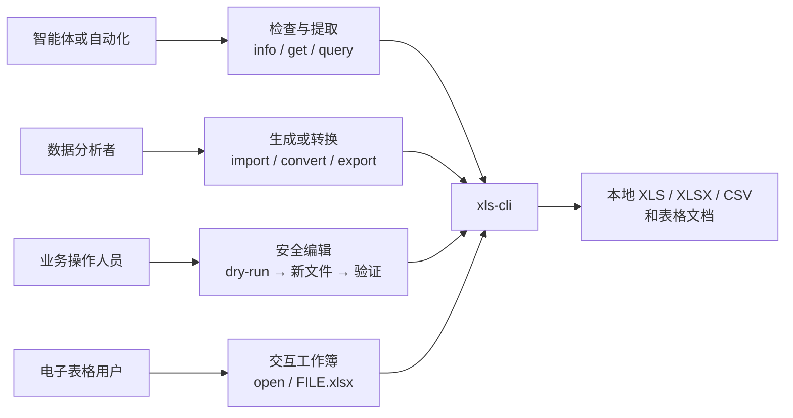
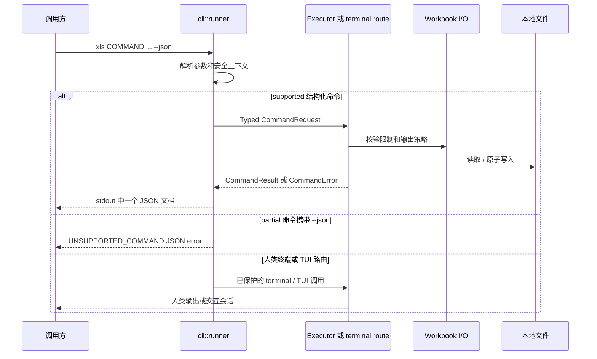
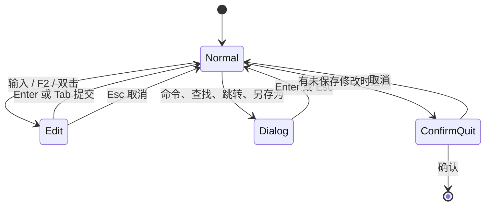

# xls-cli

`xls-cli` 是面向脚本、智能体与终端用户的安全电子表格 CLI/TUI。Cargo package 名为 `xls-cli`，最终二进制固定为 `xls`。

仓库提供 library-first JSON 命令协议、完整的人类终端命令面、交互式 TUI、npm 原生包分发与 Agent Skill。生产代码只依赖 EasyExcel-Rust 组件，不依赖旧 `xls` fork。

> 状态：当前工作区包含开发中改动。执行环境中 `xls capabilities --json` 的返回值才是支持命令的唯一事实来源。

```text
Agent Skill ─┐
             ├──> xls 二进制 ──> 结构化 CLI ──> EasyExcel 组件
Shell 用户 ──┤        │
npm 启动器 ──┘        └──> 交互式 TUI ───────> EasyExcel 组件
```

English documentation: [README.md](README.md)。设计与实施依据见[架构文档](docs/XlsCli-Architecture.zh_CN.md)和[技术方案](docs/XlsCli-Technical-Solution.zh_CN.md)。

## 使用场景



| 使用者 | 推荐入口 | 预期结果 | 边界 |
|:---|:---|:---|:---|
| 智能体或脚本 | `capabilities --json` → `info` → supported 命令 | 一个带版本的 JSON 结果 | 不得将 `partial` 命令当作 JSON API。 |
| 数据分析者 | `info`、`get`、`head`、`tail`、`query` | 元数据或表格数据 | `query` 只读。 |
| 文件生成者 | `import`、`new`、`convert`、`export` | 指定格式的新输出文件 | 每次写入先执行 dry-run。 |
| 电子表格用户 | `xls open FILE.xlsx` 或 `xls FILE.xlsx` | 交互式 TUI 会话 | 仅用户明确保存时替换关联文件。 |

## 命令说明与支持边界

二进制的 `xls capabilities --json` 是唯一能力事实来源。下表帮助读者选择当前实现的入口。

| 目标 | 命令 | JSON 能力 | 示例 |
|:---|:---|:---|:---|
| 识别工作簿 | `info`、`get`、`head`、`tail` | `supported` | `xls get report.xlsx 'Sheet1!A1:J20' --json` |
| 查询数据 | `query` | `supported`，只读 | `xls query report.xlsx 'SELECT * FROM Sheet1 LIMIT 20' --json` |
| 修改单元格和坐标轴 | `set`、`clear`、`fill`、`insert-row`、`delete-row`、`insert-col`、`delete-col` | `supported` | `xls fill in.xlsx 'Sheet1!B2:B10' 0 --output out.xlsx --json` |
| 管理工作表 | `new`、`add-sheet`、`delete-sheet`、`rename-sheet`、`recalc` | `supported` | `xls recalc in.xlsx --output out.xlsx --json` |
| 交换格式 | `convert`、`import`、`export` | `supported` | `xls import tables.md report.xlsx --dry-run --json` |
| 检查协议 | `capabilities`、`schema --command NAME` | `supported` | `xls schema --command get --json` |
| 交互工作簿 | `open` 或工作簿路径 | `partial` | `xls open report.xlsx` |
| 高级终端操作 | `grep`、`profile`、`copy`、`move`、`append`、`filter`、`sort`、`dedup`、`join`、`pivot`、`diff`、`format`、`format-set`、`to-number`、`to-date`、`style`、`autofit`、`batch`、`name`、`table`、`eval` | `partial` | `xls pivot report.xlsx --help` |

`partial` 表示存在已迁移的人类终端实现，并不表示存在结构化 result contract。为避免智能体误用，传入 `--json` 会明确返回 `UNSUPPORTED_COMMAND`；不得解析人类终端文本作为替代 API。

## 安装与验证

已发布的 npm 使用者安装启动器包。它通过 optional dependency 选择当前平台的原生包；安装过程不下载任意 URL，也不在本机临时编译。

```sh
npm install -g @easy4rust/xls-cli
xls --version
xls capabilities --json
```

npm 原生包覆盖 macOS、Linux GNU、Linux musl 与 Windows 的 `x64`、`arm64`。不支持的平台或架构会由启动器显式报错。

源码开发需要将本仓库与 `easyexcel-rust` 检出放在同一父目录，因为 `Cargo.toml` 使用相对 path dependency：

```text
parent/
├── xls-cli/
└── easyexcel-rust/
```

```sh
cargo build
./target/debug/xls capabilities --json
XLS_CLI_BINARY="$PWD/target/debug/xls" node bin/xls.js --version
```

`Cargo.toml` 声明 Rust edition 2024 与 MSRV `1.94`。

## 快速开始

先查看工作簿，再提取数据：

```sh
xls info report.xlsx --json
xls get report.xlsx 'Sheet1!A1:J200' --format json --json
xls query report.xlsx 'SELECT category, SUM(amount) AS total FROM Sheet1 GROUP BY category' --json
```

从 Markdown 表格生成工作簿，先 dry-run：

```sh
xls import tables.md generated.xlsx --dry-run --json
xls import tables.md generated.xlsx --json
xls info generated.xlsx --json
xls get generated.xlsx 'Table1!A1:F20' --json
```

打开交互式 TUI：

```sh
xls open report.xlsx
# 或
xls report.xlsx
```

TUI 已包含选择、编辑、撤销/重做、剪贴板、查找/跳转、工作表切换、冻结窗格、鼠标交互、列宽拖动、命令面板，以及正常退出或 panic 后的终端恢复。TUI 保存属于用户明确发起的覆盖操作，会替换关联路径。

## 命令执行流程



面向机器的每次写入，都应执行这个可观察序列：

| 步骤 | 命令形态 | 继续前要确认 |
|:---:|:---|:---|
| 1 | `xls capabilities --json` | 目标命令是 `supported`。 |
| 2 | `xls info INPUT --json` | 输入存在，已确认工作表和范围名。 |
| 3 | `COMMAND ... --output OUTPUT --dry-run --json` | `files[].written` 为 `false`，警告和路径可接受。 |
| 4 | 同一命令移除 `--dry-run` | 报告输出已写入。 |
| 5 | `xls info OUTPUT --json` 和精确 `xls get` | 输出可重开，并包含目标数据/单元格。 |

## 迁移源码覆盖

原独立迁移矩阵的内容已维护在此，README 现在可以独立说明迁移范围。迁移从 Easy4Rust `xls` fork 吸收 CLI/TUI 行为，同时将 core 类型路径改为 EasyExcel-Rust 组件；`xls-cli` 没有对旧 fork 的生产依赖。

| 原始区域 | 当前位置 | 保留职责 | 接入调整 |
|:---|:---|:---|:---|
| 二进制与库入口 | `src/main.rs`、`src/lib.rs`、`src/cli/runner.rs` | 薄入口、公开 CLI/TUI 产品边界、退出处理 | runner 统一 JSON/stdout/stderr 和路由。 |
| 完整终端命令面 | `src/cli/terminal.rs` | `clap` 命令、编辑、查询、格式、名称、表格 | 进入迁移路由前执行新的 guardrail。 |
| 结构化命令协议 | `src/cli/command_*.rs`、`default_command_executor.rs`、`schema.rs` | Typed request、result、error、capability | 新 library-first API；仅 `supported` 命令承诺它。 |
| 渲染与流式读取 | `src/cli/render.rs`、`src/cli/stream.rs` | table、CSV、TSV、JSON、JSONL、Markdown、HTML | 改用 EasyExcel 组件路径；流式 sink 覆盖 XLSX/CSV。 |
| 兼容适配 | `src/cli/easyexcel_components.rs` | 对旧 core 概念做窄映射 | 不重复实现工作簿、公式和格式引擎。 |
| TUI runtime | `src/tui/runtime.rs`、`src/tui/mod.rs` | 事件循环、键鼠路由、终端恢复、命令面板 | RAII guard 与 panic hook 负责终端恢复。 |
| TUI application | `src/tui/app.rs`、`editor.rs`、`layout.rs`、`parse.rs`、`theme.rs`、`ui.rs` | 选择、编辑、撤销/重做、剪贴板、查找、布局、渲染 | 使用 `easyexcel::model::Workbook` 与公式引擎组件。 |
| TUI I/O | `src/tui/workbook_io.rs` | 打开和保存会话 | 复用 CLI 资源限制和原子写入；Ctrl+S 是显式覆盖。 |

### TUI 交互契约



| 行为 | 当前契约 |
|:---|:---|
| 编辑 | 光标、范围选择、公式、剪贴板、撤销/重做、查找/跳转、工作表标签、滚动条、冻结窗格和列宽拖动均属于已迁移 TUI 能力。 |
| 保存 | 只有交互用户明确触发保存时，才通过统一 Workbook I/O 策略替换关联路径。 |
| 终端恢复 | 正常退出和 panic 均恢复 raw mode、备用屏幕和鼠标捕获。 |
| 公式状态 | TUI 打开工作簿时通过 `easyexcel_formula::Engine` 重算公式缓存。 |

## 安全写入与密码

结构化写命令默认拒绝覆盖。请选择新输出路径，先 dry-run，随后重新打开验证：

```sh
xls set source.xlsx 'Summary!B2' 42 --output revised.xlsx --dry-run --json
xls set source.xlsx 'Summary!B2' 42 --output revised.xlsx --json
xls info revised.xlsx --json
xls get revised.xlsx 'Summary!B2' --json
```

只有明确要替换精确目标时才添加 `--force`。密码不得写入命令行参数：

```sh
printf '%s\n' "$WORKBOOK_PASSWORD" | xls info protected.xlsx --password-stdin --json
xls info protected.xlsx --password-env WORKBOOK_PASSWORD --json
```

结构化 CLI 对不可信输入的默认上限为：单文件 256 MiB、256 个工作表、总计 2,000,000 行、500,000 个公式单元格。可用对应的 `--max-*` 参数收紧上限。迁移终端命令目前会拒绝资源上限参数，不会静默忽略。

JSON 模式下 stdout 只输出一个完整的结果或错误对象。成功结果包括 `schema_version`、`command`、`data`、`files`、`warnings`、`stats`、`dry_run`；错误使用稳定码，例如 `OVERWRITE_DENIED`、`RESOURCE_LIMIT`、`UNSUPPORTED_COMMAND`。

## Agent Skill

Skill 源文件为 [skills/xls-cli/SKILL.md](skills/xls-cli/SKILL.md)。`scripts/sync-skills.js` 将其同步到 OpenClaw 与 Hermes 的分发目录。

规定的写入序列是：

```text
capabilities → info → dry-run → 写入新文件 → info + 精确 get 验证
```

这使 runtime capability manifest，而不是可能过时的 README，成为能力事实来源。

## 开发与发布

CI 会执行格式化、Clippy、测试、JavaScript 语法检查与 `npm pack --dry-run`。本地可运行：

```sh
cargo fmt --check
cargo clippy --all-targets
cargo test --all-targets
node --check bin/xls.js
node --check bin/platform.js
npm pack --dry-run --ignore-scripts
```

推送 `vX.Y.Z` 标签会触发发布工作流：构建 8 个原生目标包，校验所有 npm 包版本，先发布平台包再发布启动器，并上传二进制与 SHA-256 校验和。

## 来源与许可证

CLI/TUI 从 Easy4Rust 的 `xls` fork 迁移，并接入 EasyExcel-Rust 组件；迁移范围见上文“迁移源码覆盖”。许可证为 [MIT](LICENSE-MIT) 或 [Apache-2.0](LICENSE-APACHE)；来源和第三方说明见 [NOTICE](NOTICE)。

### 历史迁移验证快照

迁移交接在 2026-08-05 记录了格式化、Clippy、106 项 Rust 测试、CLI/TUI 冒烟和 8 个 npm 平台包版本检查均通过。这是当时的迁移证据，不表示不同本地依赖 checkout 的当前状态；当前验证应执行“开发与发布”章节中的命令。
