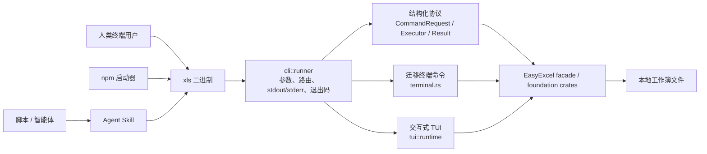
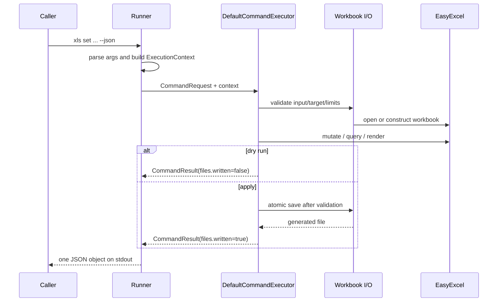
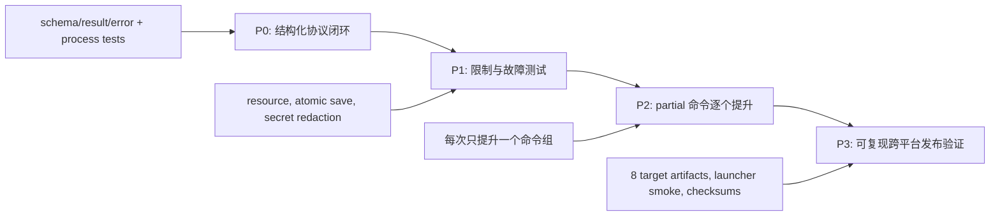

# xls-cli 架构设计

> **文档说明**：基于当前仓库静态源码与本地 binary capability 输出，定义 `xls-cli` 的组件边界、运行时流程、安全契约、演进边界与验证方式。
>
> **版本**：V1.0.0
> **最后更新**：2026-08-05
> **证据边界**：目标目录未包含 `.codegraph/`，因此本报告不能提供 CodeGraph 运行查询证据；以下“当前实现”均来自静态源码、构建清单、CI 配置和本地 `target/debug/xls capabilities --json` 输出。尚未把本次结论当作生产环境运行证据。

## 1. 架构驱动与范围

`xls-cli` 的问题空间不是复刻一个电子表格库，而是向自动化调用方提供可审计、可防护的电子表格操作产品，同时保留人类操作所需的 TUI 与命令面。

| 驱动 | 架构响应 | 当前落点 | 可验证证据 |
|:---|:---|:---|:---|
| 智能体可消费 | 稳定 JSON 请求/结果、能力清单与错误码 | `src/cli/command_*.rs`、`capability_manifest.rs`、`runner.rs` | `tests/cli_protocol.rs` |
| 不意外改写文件 | 默认拒绝覆盖、dry-run、原子保存 | `execution_context.rs`、`workbook_io.rs` | 写命令测试和 `OVERWRITE_DENIED` |
| 不可信输入可控 | 文件、工作表、行、公式单元格的资源限制 | `args.rs`、`execution_context.rs`、`workbook_io.rs` | 超限返回 `RESOURCE_LIMIT` |
| 人类交互 | CLI 自动分流到 TUI，TUI 独立维护会话状态 | `runner.rs`、`tui/runtime.rs`、`tui/app.rs` | PTY 冒烟需在发布前运行 |
| 一次实现多分发 | Rust 二进制为核心，npm 仅做本地启动器 | `Cargo.toml`、`bin/*.js`、`packages/*` | `.github/workflows/release.yml` |
| 迁移保真 | 旧终端能力与新结构化协议并行，但不伪造 JSON 成功 | `terminal.rs`、`capability_manifest.rs` | `partial` + `UNSUPPORTED_COMMAND` |

**包含范围**：XLS/XLSX/CSV 工作簿读写、Markdown/HTML/JSON 表格交换、只读 SQL 查询、公式重算、终端 UI、原生 npm 包与 Agent Skill。

**明确不包含**：云端同步、多用户协作、服务端 API、远程表格抓取、HTML 脚本执行、npm 安装期下载/本地编译、把 `partial` 命令包装成结构化协议。

## 2. 当前状态、目标状态与边界

| 视图 | 结论 |
|:---|:---|
| 当前实现 | 一个 Rust 2024 crate（`xls-cli`），提供 `xls` binary；结构化命令、迁移终端命令和 TUI 共用 EasyExcel-Rust 组件。Cargo path dependency 要求相邻的 `easyexcel-rust` checkout。 |
| 当前事实 | capability manifest 标记 22 个命令为 `supported`，并标记一批迁移终端命令为 `partial`；本地 debug binary 已返回 schema `1.0` 的 manifest。 |
| 目标状态 | 所有对智能体公开的命令具备明确定义的 JSON request/result/schema、限制、错误模型、测试和成功/失败语义；人类终端命令可继续独立演进。 |
| 平台边界 | 工作簿模型、文件格式解析、公式引擎及流式 I/O 归 EasyExcel 组件所有；`xls-cli` 不重定义这些基础模型。 |

## 3. 组件、职责与依赖方向

| 组件 | 职责 | 不能承担的职责 | 核心路径 |
|:---|:---|:---|:---|
| 二进制入口 | 启动产品边界 | 业务逻辑、文件 I/O | `src/main.rs` |
| Runner | `clap` 解析、TUI/终端/结构化路由、JSON 或人类渲染、退出码 | 工作簿操作实现 | `src/cli/runner.rs` |
| Request/Executor | 将 CLI 参数映射为类型化请求，执行 supported 命令 | 进程输出与参数解析 | `src/cli/request.rs`、`default_command_executor.rs` |
| Protocol model | 版本化 request/result、错误码、capability 与 schema | 旧命令的虚假兼容 | `command_request.rs`、`command_result.rs`、`command_error.rs`、`schema.rs` |
| I/O policy | 格式识别、限制、目标校验、原子写入 | UI 会话状态 | `workbook_io.rs` |
| Terminal adapter | 为迁移命令保留人类终端行为并施加新 guardrail | 承诺 JSON 成功 | `terminal.rs`、`easyexcel_components.rs` |
| TUI | 工作簿会话、键鼠事件、编辑状态、呈现、终端恢复 | 脚本协议 | `src/tui/*` |
| npm launcher | 按平台选择已安装 native package，传递退出码 | 网络下载和 JIT 编译 | `bin/xls.js`、`bin/platform.js`、`install.js` |
| Skill | 编排安全调用序列 | 重实现解析或修改工作簿 | `skills/xls-cli/SKILL.md` |

依赖方向必须维持为：`cli`、`tui` → EasyExcel facade/foundation；npm 与 Skill → `xls` binary。不得恢复 `xls-cli` 对旧 `xls` fork 的生产依赖。

## 4. 运行流程与失败语义

### 4.1 结构化命令

失败必须由 `CommandError` 显式表达：参数问题为 `INVALID_ARGUMENT`，格式不支持为 `UNSUPPORTED_FORMAT`，文件不存在为 `FILE_NOT_FOUND`，超限为 `RESOURCE_LIMIT`，目标冲突为 `OVERWRITE_DENIED`，读写失败为 `READ_FAILED`/`WRITE_FAILED`，查询失败为 `QUERY_FAILED`。JSON 模式下 error 同样只写 stdout，进程以非零码退出。

### 4.2 迁移终端命令与 TUI

Runner 首先识别无 `--json` 的迁移终端命令和文件路径；这些请求进入 `terminal.rs`。在进入旧命令面前，Runner 执行写保护、目标存在检查与密码 argv 检查。`--json` 改走结构化协议，因而 partial 命令返回 `UNSUPPORTED_COMMAND`，这是刻意的能力收缩而不是缺陷掩盖。

直接指定工作簿路径或 `open` 启动 TUI。`tui::runtime` 以约 100 ms 事件轮询驱动 redraw；`TermGuard`、panic hook 共同恢复 raw mode、备用屏幕和鼠标捕获。用户按下保存才以 `OverwritePolicy::Replace` 覆盖会话关联路径；该例外仅限明确的 UI 保存动作。

## 5. 数据、协议与安全

### 5.1 状态与数据所有权

| 状态 | 权威所有者 | 生命周期 | 一致性要求 |
|:---|:---|:---|:---|
| 输入/输出工作簿 | 本地文件 + EasyExcel model | 单次命令或 TUI 会话 | 写入前后须可解析；写命令通过临时文件后替换 |
| 命令上下文 | `ExecutionContext` | 单次结构化命令 | 不跨调用复用密码；默认拒绝覆盖 |
| 结构化响应 | `CommandResult` / `CommandError` | 单次进程输出 | schema version 固定、stdout 只含一个 JSON 对象 |
| TUI 交互状态 | `tui::App` | 当前会话 | 通过 undo/redo 栈维护本地编辑历史 |
| capability | `CapabilityManifest::current()` | 构建期实现快照 | 必须与 executor 和测试同步 |

### 5.2 Guardrails

| 风险 | 当前控制 | 剩余风险与处理 |
|:---|:---|:---|
| 覆盖源文件 | `OverwritePolicy::Deny` 默认值、`--dry-run`、显式 `--force` | TUI 明确保存允许覆盖；UI 确认语义需要 PTY 回归测试 |
| 密码泄露 | 只允许 stdin/env，`SecretString` 的 Debug 脱敏，拒绝 `--password`/`-p` | 环境变量仍受宿主进程权限模型约束 |
| 大文件/公式耗尽资源 | `ResourceLimits`：默认 256 MiB、256 sheet、2M 行、500K 公式单元格 | 上限是默认策略，不是已测性能指标；要做边界负载测试 |
| HTML 攻击面 | 仅解析本地静态 table，不执行脚本、不加载网络资源 | HTML/CSS 兼容性需以 fixture 约束 |
| 协议误用 | manifest、stable error、partial 返回 unsupported | 新增命令必须先补 schema 和 process-level 测试 |
| npm 供应链 | optional package 解析；无下载/现场编译 | 发布前须核验包版本、二进制、许可证和 checksums |

## 6. 可观测性、部署与恢复

这是本地 CLI，不持久化服务端遥测。可观测性因此以可机器读取的结果、稳定错误码、stderr 人类诊断、进程退出码、CI 工件与 release checksum 为主。

| 操作阶段 | 检查 | 失败恢复 |
|:---|:---|:---|
| 安装 | `xls --version`、`xls capabilities --json` | 重新安装当前平台 optional package；源码则 `cargo build` |
| 写入前 | `info`、dry-run、审阅 `files`/`warnings` | 修正范围、限制或新输出路径；不使用盲目 `--force` |
| 写入后 | `info OUTPUT` + 精确 `get OUTPUT RANGE` | 保留源文件，删除或替换新输出仅在用户授权后执行 |
| TUI 异常 | 退出恢复终端属性 | 必要时执行 `reset`；随后用 CLI 重新检查文件 |
| 发布 | CI 验证全部目标和包版本 | 禁止仅重发 launcher；先修复/重发失败平台包并保持版本一致 |

发布拓扑由 `.github/workflows/release.yml` 定义：8 个目标的 native package → 下载并验证版本 → 发布平台 npm 包 → 发布 launcher → 生成 GitHub release binaries 和 `SHA256SUMS`。这是一条发布设计，不是本机发布已完成的声明。

## 7. 关键决策与演进路线

| ADR | 决策 | 理由 | 回退/复议条件 |
|:---|:---|:---|:---|
| ADR-001 | `xls` binary 是唯一执行内核，npm 只启动 | 减少 Node/Rust 逻辑分叉并避免安装期编译 | 需要纯 JS fallback 时，先定义等价协议与安全测试 |
| ADR-002 | `partial` 不提供 JSON | 智能体不能依赖不稳定的人类输出 | 每个命令已有 schema、result、错误与合约测试时提升为 supported |
| ADR-003 | 新文件 + dry-run 为默认写入路径 | 避免不可逆的数据损失 | 出现明确的事务性原地更新方案且有崩溃恢复证明 |
| ADR-004 | 基础模型委托 EasyExcel | 防止重复实现格式与公式语义 | EasyExcel API 无法满足需求且替代模块有清晰所有权 |

## 8. 验收标准与证据

| 层面 | 通过条件 | 当前证据/待补证据 |
|:---|:---|:---|
| 协议 | `capabilities --json` 可解析；成功/错误 stdout-only | 已本地执行 manifest；`tests/cli_protocol.rs` 覆盖 success、unsupported、import→get |
| 安全写入 | dry-run 不生成文件，apply 后可重开 | process 测试覆盖 Markdown import 链路；需持续增加 XLS/XLSX/CSV fixture |
| 代码质量 | format、Clippy、all-target tests 都在隔离依赖树通过 | 本次 `cargo fmt --all` 会进入相邻依赖工作树并被其未格式化文件阻断；须在干净依赖 checkout 的 CI 上确认总门禁 |
| npm | JS 语法与打包清单可通过 | 本次 `node --check` 和 `npm pack --dry-run --ignore-scripts` 已通过 |
| TUI | PTY 打开、编辑、保存、退出并恢复终端 | 架构需要该 smoke；本次未重新运行 PTY 测试 |

---

**文档版本**：V1.0.0
**创建日期**：2026-08-05
**最后更新**：2026-08-05
**文档状态**：✅ 待评审
