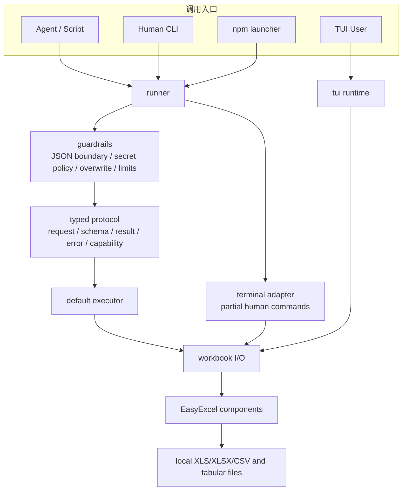
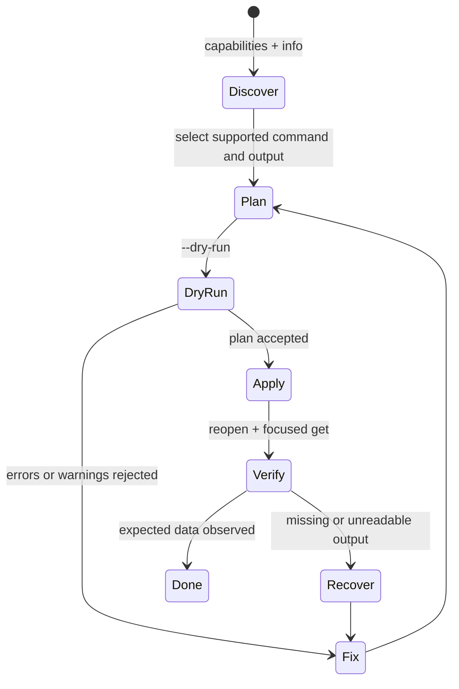

# xls-cli 技术方案与实施路线

> **文档说明**：将 `xls-cli` 当前源码能力转化为可执行的工程交付方案，覆盖协议收敛、质量门、发布、风险与可验收里程碑。
>
> **版本**：V1.0.0
> **最后更新**：2026-08-05
> **状态口径**：已实现能力以 `xls capabilities --json` 为准；本方案中的里程碑均为目标，不表示已发布。

## 1. 目标、非目标与交付物

### 1.1 目标

1. 将面向智能体的电子表格操作固化为版本化、可验证、无歧义的 JSON 协议。
2. 将“先检测、再 dry-run、写入新文件、重新读取验证”固化到 CLI、Skill、测试和文档。
3. 让人类终端命令与 TUI 继续可用，但不污染结构化 API 的稳定性。
4. 用原生 Rust binary + platform npm package 达到可复现的八目标发布。

### 1.2 非目标

- 不建设 HTTP 服务、账户、云存储或多用户协作。
- 不为了兼容旧 CLI 而把人类文本输出声明成 JSON API。
- 不在 npm install 期间下载任意二进制或编译 Rust。
- 不复制 EasyExcel 的工作簿、公式或文件格式实现。

### 1.3 本次方案的四类交付

| 交付物 | 责任边界 | 验收输出 |
|:---|:---|:---|
| 结构化 CLI | `src/cli/command_*`、executor、schema、runner | stable JSON、错误码、能力清单、process tests |
| 终端/TUI | `src/cli/terminal.rs`、`src/tui/*` | 人类可操作、写保护、退出后终端恢复 |
| 包分发 | `package.json`、`bin/*`、`packages/*`、release workflow | 指定平台可定位 native binary，版本完全一致 |
| Agent 操作规约 | `skills/xls-cli/SKILL.md` | 不越过 capability、dry-run 与回读验证 |

## 2. 技术基线与选型

| 领域 | 决策 | 源码/清单证据 | 选型理由 |
|:---|:---|:---|:---|
| 语言与工具链 | Rust edition 2024，MSRV 1.88 | `Cargo.toml` | 与 EasyExcel workspace 对齐，用单二进制承载 CLI 与 TUI |
| 参数解析 | `clap` derive | `src/cli/args.rs` | 保持命令面、帮助和全局 guardrail 统一 |
| 序列化 | `serde` / `serde_json` | `command_request.rs`、`command_result.rs` | 可版本化并适配智能体调用 |
| 电子表格能力 | 仅依赖 `easyexcel` facade | `Cargo.toml`、`easyexcel_components.rs` | 基础 crate 对产品层隐藏，保持单一格式/模型/公式权威 |
| TUI | `ratatui` + `crossterm` + `tui-textarea` | `Cargo.toml`、`src/tui/*` | 终端渲染与原始模式生命周期可控 |
| npm 分发 | JS launcher + optional native packages | `package.json`、`bin/platform.js` | 保留 npm 使用体验，不携带运行时下载器 |
| 错误 | `thiserror` + stable `ErrorCode` | `command_error.rs` | 区分可处理错误、避免字符串匹配 |

## 3. 实施架构



实现纪律：

- `main.rs` 必须保持薄入口；进程输出和退出码只在 runner 统一处理。
- executor 接受 `CommandRequest + ExecutionContext`，不能直接读 argv 或写 stdout。
- 每个新智能体命令都必须同步修改 `CommandName`、request、executor、capability manifest、schema、README/Skill 与 process test。
- terminal-only 命令保持 `partial`，直到结构化 result contract 和测试完成；不得以解析终端文本替代。
- `src/tui/mod.rs` 仅组织模块和 re-export；TUI 业务状态分散在单一职责文件中。

## 4. 协议与安全方案

### 4.1 结构化输出契约

成功输出固定为：

```json
{
  "schema_version": { "major": 1, "minor": 0 },
  "command": "get",
  "data": {},
  "files": [{ "path": "result.xlsx", "written": true }],
  "warnings": [],
  "stats": {},
  "dry_run": false
}
```

失败输出固定为带稳定 code 的 `error` 对象。JSON 模式 stdout 只能出现这一个 JSON 文档；日志与人类提示不能混入 stdout。`schema --command NAME` 应返回与运行时 capability 相一致的 JSON Schema。

### 4.2 受控写入状态机



| 控制点 | 实现策略 | 自动化验收 |
|:---|:---|:---|
| 覆盖 | 默认 `Deny`，仅显式 `--force`/TUI 用户保存允许 replace | 已存在目标拒绝；源文件哈希不变 |
| dry-run | 计算/校验但 `files[].written=false` | dry-run 后目标文件不存在 |
| 原子性 | 写临时文件后替换 | 写入错误不留下可被误认为成功的目标 |
| 资源 | 参数默认 256 MiB、256 sheet、2M 行、500K formula cells | 每类限制 fixture 返回 `RESOURCE_LIMIT` |
| 密码 | stdin/env → `SecretString`；拒绝 argv secret | stdout/stderr/Debug 均不含密码 |
| HTML | 仅本地静态 `<table>`，禁脚本/网络 | script 与远程资源 fixture 不触发执行/访问 |

## 5. 分阶段路线图

### 阶段 A：结构化协议闭环（P0）

范围：逐个确认当前 `supported` 命令具有 request、schema、result、错误、dry-run 和 process-level 成功/失败测试。

| 工作项 | 退出条件 |
|:---|:---|
| Manifest 一致性检查 | manifest 每个 `supported` 命令都有可执行 executor 分支 |
| Schema 完整性 | 所有 structured command 的字段、required、格式、版本可被 fixture 验证 |
| stdout-only | success、parse failure、runtime failure 都只在 stdout 输出一个 JSON |
| 文件回读 | 每种写格式都执行 write → reopen → focused assertion |

### 阶段 B：可靠性与边界测试（P0）

范围：将当前“源码存在的 guardrail”推进为可重复的回归证据。

| 风险 | 最小测试集 | 通过条件 |
|:---|:---|:---|
| 文件破损 | 不完整 XLS/XLSX、错误密码、无扩展名 | 无 panic；稳定错误码；无写入 |
| 资源上限 | 文件/工作表/行/公式分别越限 | 精确 `RESOURCE_LIMIT` 且不耗尽宿主 |
| 写入中断 | 模拟临时写入或 rename 失败 | 源/原目标可恢复；结果不虚报 written |
| 协议漂移 | golden JSON + schema validation | 版本变更有明确迁移说明 |
| TUI 生命周期 | PTY 打开、编辑、保存、退出、panic hook | terminal mode 与鼠标状态恢复 |

### 阶段 C：partial 命令收敛（P1）

按“读取 → 无副作用变换 → 单文件写入 → 多输入/批量”的风险次序推进，每次只提升一个命令组。

| 命令组 | 当前状态 | 升级前必须补齐 | 建议优先级 |
|:---|:---|:---|:---|
| `grep`、`profile`、`format`、`eval` | partial | 结果数据模型、JSON renderer、golden 测试 | P1 |
| `copy`、`move`、`append`、`filter`、`sort`、`dedup` | partial | 输入/输出所有权、dry-run、回读断言 | P1 |
| `join`、`pivot`、`diff` | partial | 多工作簿 schema、内存预算、错误/排序语义 | P1 |
| `style`、`autofit`、`name`、`table`、`batch` | partial | 格式/元数据 result、原子性、覆盖保护 | P2 |

### 阶段 D：分发和发布可信度（P1）

1. 对每个 release target 运行 `xls --version`、`capabilities --json` 与一个 fixture import/export smoke。
2. 验证 launcher 在每个 `platform × arch × libc` 组合定位到正确 package。
3. 在 publish 前执行版本一致性检查；平台包失败时禁止发布主 launcher。
4. 保存二进制 SHA-256、许可证、NOTICE、npm 包清单和测试日志作为 release evidence。

## 6. 验证矩阵与 CI

| 门禁 | 命令/载体 | 覆盖对象 | 当前限制 |
|:---|:---|:---|:---|
| 格式 | `cargo fmt --check` | Rust 源码格式 | 2026-08-06 本地通过 |
| 静态检查 | `cargo clippy --all-targets --all-features -- -D warnings` | Rust lint | 2026-08-06 本地通过 |
| 单元/进程 | `cargo test` | executor、协议、I/O、TUI logic | 104 unit + 3 process tests 通过；PTY 仍独立验证 |
| JS | `node --check bin/xls.js` 等 | launcher 与辅助脚本 | 不能替代实际目标平台运行 |
| 包 | `npm pack --dry-run --ignore-scripts` | 发布清单 | 不验证 native binary 本身 |
| 发布 | `.github/workflows/release.yml` | 八目标构建与 npm/GitHub 流程 | tag workflow 的运行记录才是发布证据 |

建议把 protocol golden tests、fixture corpus 与 package smoke 分别作为 CI 的命名步骤，以便失败可以定位到协议、格式、TUI 或分发边界，而不是只得到一个总失败。

## 7. 风险、决策与回滚

| 风险 | 触发信号 | 决策/缓解 | 回滚方式 |
|:---|:---|:---|:---|
| capability 与实现漂移 | manifest 声称 supported 但 executor 不可用 | 自动 cross-check；发布阻断 | 降级为 partial 或修复实现后再发布 |
| 结构化输出破坏旧自动化 | golden JSON/schema 变化 | major/minor version 规则 + compatibility test | 保留旧 schema handler 或发布显式 major 版本 |
| 错误覆盖造成数据丢失 | 已存在文件被无提示替换 | deny-by-default、dry-run、精确 force | 使用源文件/备份恢复；禁止自动删除 |
| 路径依赖不可复现 | CI/用户找不到相邻 EasyExcel | 记录 checkout 布局；CI 显式 checkout | 未来改为已发布 crate 或 workspace lock 方案前先做兼容验证 |
| 平台包不一致 | launcher 找不到/运行错 binary | 先平台包后 launcher，版本检查与目标 smoke | 停止 launcher 发布，重发一致的 native package |

## 8. 交付验收清单

- [ ] `README.md` 与 `README.zh-CN.md` 的命令、路径、版本、边界和链接一致。
- [ ] 运行时 manifest 与文档中的 supported/partial 口径一致。
- [ ] 每个 structured 写命令都有 dry-run、写入、回读、覆盖拒绝与失败样例。
- [ ] 所有 partial 命令的 `--json` 都稳定返回 `UNSUPPORTED_COMMAND`，直到正式提升。
- [x] 本地相邻 EasyExcel checkout 下 format、Clippy、tests 全绿；CI 仍需保存对应运行记录。
- [ ] release 流水线对八个目标包都有实际 binary smoke、版本校验与 checksum。
- [ ] TUI PTY 测试验证终端恢复，不把单元测试当作终端生命周期证据。

---

**文档版本**：V1.0.0
**创建日期**：2026-08-05
**最后更新**：2026-08-05
**文档状态**：✅ 待评审
